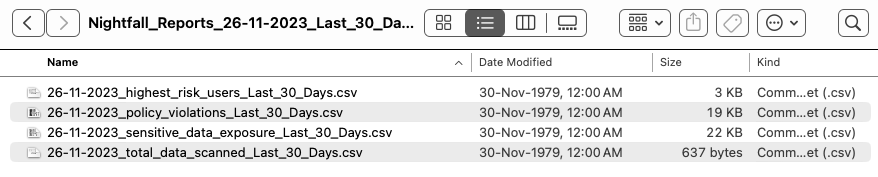
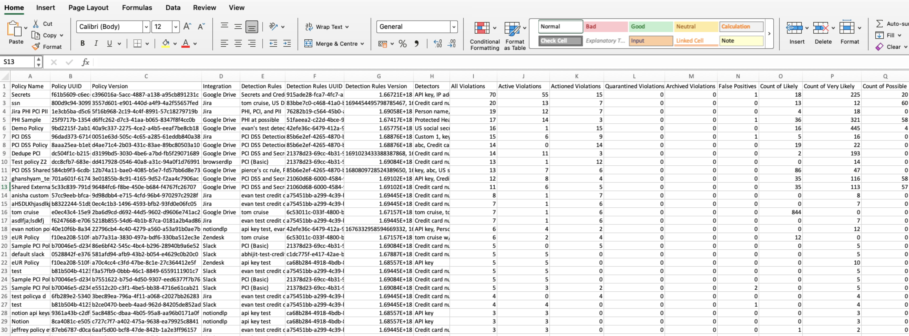
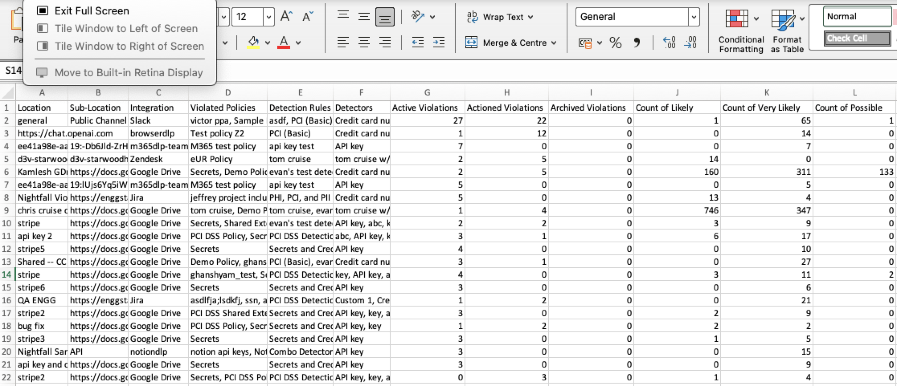
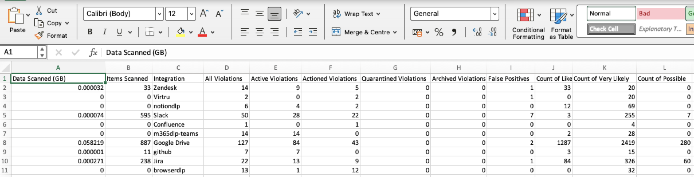

# Nightfall Dashboard

The Nightfall Dashboard provides centralized, aggregated insights across all native integrations in the Nightfall console. The Nightfall dashboard enables you to quickly determine, at a high level, the types, quantities, and trends of sensitive data violations with the ability to break down and filter these violations based on particular integrations, filters, and likelihoods, over various periods of time.

The dashboard consists of various visualizations like widgets, charts, and tables. You can apply filters to view data specific to a time period, integration, detector, status, and so on. The Nightfall Dashboard automatically refreshes every few minutes.&#x20;

The various tasks that you can perform on the Dashboard are as follows.&#x20;

## View Latest Data

The Dashboard displays the date and time when the data was last refreshed. The Nightfall dashboard refreshes automatically every few minutes. You can manually trigger a refresh by refreshing your browser.&#x20;

## Filtering Data

Nightfall provides you with various filters to slice and dice data on the dashboard. This ensures that you view data that is specific to your requirements. The various filters are described as follows.&#x20;

### Old Data Filter

This filter allows you to view historical data. You can choose to view data for the last 7, 30, 90, 120, 180 days, or set a custom date range. When you apply a specific time period, all the data on the dashboard is fetched from the selected time period till the current date. For instance, assume that the current date is 1 December 2023. If you select the time filter as Last 7 days, the data is displayed from 25 Nov 2023 to 1 December 2023. Similarly, if you select the time filter as last 30 days, the data is displayed from November 2, 2023, to December 1, 2023. By default, this filter displays the data for the last 7 days. You can also set a custom date range.&#x20;

<figure><figcaption></figcaption></figure>

### Miscellaneous Filters

The miscellaneous filters allow you to apply filters on various Nightfall entities. The entities are described as follows.&#x20;

#### Detector

This filter facilitates you to view data specific to a Detecter.&#x20;

#### Integration

This filter facilitates you to view data specific to an Integration&#x20;

#### Likelihood

This filter facilitates you to view data specific to a Likelihood of sensitive data being detected.

#### Status

This filter facilitates you to view data specific to the status of Violation. Basically, you can use this filter to view violations caused by a specific user(s

#### User

This filter facilitates you to view data specific to users who triggered violations.

To apply a filter:

1. Click the **Filter** button.
2. Click **+ Add Filter**.
3. Select a filter Entity from the **When** drop-down menu. The options in the **Is** drop-down menu are based on the filter entity selected.
4. Select an option or multiple in the **Is** drop-down menu. For instance, if you selected **Integration** as the entity, then you must select the check boxes for the integrations whose data you wish to view.&#x20;
5. (Optional) Repeat steps 2-5 to add multiple filters.&#x20;
6. Click **Apply**.

<figure><figcaption></figcaption></figure>


* You can add multiple filters. Nightfall allows you to add a maximum of three filters.
* When you add multiple filters, logical AND operation is applied between the filters. As a result, only the data that matches all the applied filters is displayed. &#x20;
* To remove the miscellaneous filters, click the **Reset** button.


<figure><figcaption></figcaption></figure>

## Analysing Visualizations

The Nightfall Dashboard displays a list of widgets, charts, and tables. These visualizations are described as follows. The data displayed on the visualizations depends on the filters applied.

### Widgets

The Nightfall Dashboard displays the following widgets.&#x20;

#### Total Data Scanned

This widget displays the amount of data scanned by Nightfall. You can view the data scanned in real-time and also historically. This widget also displays a line chart. This line chart shows data scanned on each day when you hover over the chart. The x-axis of this chart changes based on the filters applied in the [#historic-data-filter](overview.md#historic-data-filter "mention").

<figure><figcaption></figcaption></figure>

Apart from the total scanned data, this widget also displays data scanned at a granular level; you can view the real-time and historical data scanned for each integration. When you hover over an integration, you can view the real-time and historical data scanned for the integration. If you have applied a miscellaneous filter to display data for a specific integration, granular data is displayed only for the filtered integration.&#x20;

<figure><figcaption></figcaption></figure>

#### All Violations

This widget displays all the violations recorded in Nightfall during the time period selected in the [#historic-data-filter](overview.md#historic-data-filter "mention"). This widget displays the number of violations irrespective of their status ( New, Active, Pending, Resolved, and Expired). If you apply any [#miscellaneous-filters](overview.md#miscellaneous-filters "mention"), violations are displayed only for the filters applied.

#### Active Violations

his widget displays all the actioned violations recorded in Nightfall during the time period selected in the [#historic-data-filter](overview.md#historic-data-filter "mention"). These are the violations that are generated but no action has been taken on them yet. If you do not take any action on an active violation within 30 days from the date on which it was generated, the violation expires. If you apply any [#miscellaneous-filters](overview.md#miscellaneous-filters "mention"), violations are displayed only for the filters applied.

#### Actioned Violations

This widget displays all the actioned violations recorded in Nightfall during the time period selected in the [#historic-data-filter](overview.md#historic-data-filter "mention"). These are the violations on which you have acted (notified in Email or Slack, created JIRA ticket, and so on) but have not yet marked as resolved. This widget displays the number of violations whose current status is active. If you apply any [#miscellaneous-filters](overview.md#miscellaneous-filters "mention"), violations are displayed only for the filters applied.

You can also view a line chart at the bottom of these three widgets. This line chart shows the number of violations generated each day. The x-axis of this chart changes based on the filters applied in the [#historic-data-filter](overview.md#historic-data-filter "mention").

<figure><figcaption></figcaption></figure>

**Percentile Difference Value**

All the widgets display a percentile value, apart from the actual value. This percentile value is either in positive or negative. Nightfall generates this value by the following method.&#x20;

* The current value of the widget and the filter value selected in [#historic-data-filter](overview.md#historic-data-filter "mention") are considered.&#x20;
* This value is compared with the equivalent preceding time period. If the current value is better than the preceding value, the value is converted to a percentage and displayed as a positive result. However, if the current value is worse than its preceding value, the percentile difference is displayed in a negative.

<figure><figcaption></figcaption></figure>

* For instance, consider the above image. The value of **Active Violations** is 25. The selected [#historic-data-filter](overview.md#historic-data-filter "mention") is **Last 7 Days**. Let's assume that the current date (today's date) is 1 Dec 2023. This implies that there were a total of 25 violations from 25 Nov to 1 Dec (last 7 days).&#x20;
* The value 25 is compared with the equivalent preceding time period (7 days prior to 25 Nov which is Nov 19 to Nov 25). In this case, the current value 25 is greater than its preceding value by 76%. This implies that active violations increased by 76% in a span of a week. Hence, the percentile difference value is displayed as -76%. (An increase in number of violations is not a good sign. Hence it is displayed in red with a negative sign).&#x20;
* The percentile difference value always compares the current value with its equivalent preceding value. In the above case, the [#historic-data-filter](overview.md#historic-data-filter "mention") was selected as the **Last 7 Days**. hence the current value was compared with its preceding 7 days' value. If you select **Last 30 Days** as [#historic-data-filter](overview.md#historic-data-filter "mention"), then the current value is compared to the preceding 30 days' value.

The above calculation method is applied in the calculation of percentile difference value for all the widgets.&#x20;

### Charts

The Nightfall Dashboard consists of two bar charts. The bar charts are described as follows.&#x20;

#### Top Detectors

This bar chart displays the top five detectors with the highest number of violations during the time period selected in [#historic-data-filter](overview.md#historic-data-filter "mention"). This bar chart consists of the top five detectors on the x-axis and the number of violations on the y-axis. Each bar represents a detector. When you hover over a bar, you can view the number of violations triggered by the detector.

<figure><figcaption></figcaption></figure>

#### Top Policies

This bar chart displays the top five policies with the highest number of violations during the time period selected in [#historic-data-filter](overview.md#historic-data-filter "mention"). This bar chart consists of the top five policies on the x-axis and the number of violations on the y-axis. Each bar represents a policy. When you hover over a policy, you can view the number of violations triggered by the detector.

<figure><figcaption></figcaption></figure>


## Violation vs Findings

The data displayed in the above bar charts contain violation data. Each violation may further have multiple Findings. To check the number of findings in each Violation, see . To understand the difference between Violations and Findings, see [#violation-vs-finding](sdp_events/#violation-vs-finding "mention").


### Tables

The Tables section on the Nightfall Dashboard consists of the following.&#x20;

#### Highest Risk Users

This table contains the details of the users who have triggered the highest number of violations. The columns of this table display details like user name, number of violations, and the integrations on which the violations are caused. You can rearrange the contents of the **User** column alphabetically and the **Violation Count** column in increasing or decreasing order.

<figure><figcaption></figcaption></figure>

## Generating Reports

The Nightfall Dashboard allows you to generate reports. The Dashboard currently supports four types of reports.&#x20;

* **Sensitive Data Exposure**: This report consists of information like the location of sensitive data, the nature of sensitive data, and the overall risk associated with it.&#x20;
* **Policy Violations**: This report provides information on the policies that are generating the highest number of violations.&#x20;
* **Highest Risk Users**: This report provides information about users who are triggering the highest number of violations across all integrations.&#x20;
* **Total Data Scanned**: This report displays the total data scanned by Nightfall across all integrations.&#x20;

You can select the historical time period for which you wish to generate the reports. The time period is the same as the [#historic-data-filter](overview.md#historic-data-filter "mention").

To generate a Report:

1. Click **Generate Reports**.&#x20;
2. Select the check boxes of the reports to be included. Click **Select All** to include all the reports.&#x20;
3. Select the historic time period for which you wish to generate the report.
4. Click **Generate**. A pop-up window appears that confirms the Email ID to which reports will be sent.
5. Click **Done**.

The Report is mailed to the Email ID of the logged-in user.

<figure><figcaption></figcaption></figure>

## Analyzing Downloaded Reports

When you generate a report, it is sent as an Email to the logged-in user. This email contains a link to download the reports. The download link expires in 7 days from the date you received the Email.&#x20;

<figure><figcaption></figcaption></figure>

A folder is downloaded to your system. The folder is named as **Nightfall\_Reports\_**_**\<date on which report was gnerated>\_\<historical time period>**_. This folder contains the reports that you selected for download in step 2 of the [#generating-reports](overview.md#generating-reports "mention") section. All the downloaded files are in CSV format.&#x20;

The following image shows a folder downloaded on 26-11-2023 for the last 30 days. All four reports were selected for download hence you can see four CSV files.&#x20;

<figure><figcaption></figcaption></figure>

### Analyzing Highest Risk Users Report

The Highest Risk Users report is named as _**\<date on which report was generated>**_**highest\_risk\_users\_**_**\<histroical time period selected>.**_ This report displays the list of users who have triggered the maximum number of violations. The users are sorted in decreasing order of violations triggered. Hence the user who caused the highest number of violations is at the top and the user who triggered the lowest number of violations is at the bottom. This report also displays the integrations, policies, and Detection rules that were violated.&#x20;

This report has the following columns.&#x20;

<table><thead><tr><th width="272">Column Name</th><th align="center">Description</th></tr></thead><tbody><tr><td>User Name</td><td align="center">The user name of the user who triggered the violation.</td></tr><tr><td>Integration</td><td align="center">The integration(s) on which the user triggered the violation.</td></tr><tr><td>Violated Policies</td><td align="center">The policy(ies) that the user violated.</td></tr><tr><td>Detection Rules</td><td align="center">The detection rule(s) that the user violated.</td></tr><tr><td>All Violations</td><td align="center">The total number of violations triggered by the user (for the time period selected in <a data-mention href="overview.md#historic-data-filter">#historic-data-filter</a>).</td></tr><tr><td>Active Violations</td><td align="center">The total number of violations that were in active status at the time the report was downloaded. </td></tr><tr><td>Actioned Violations</td><td align="center">The total number of violations that were in actioned status at the time the report was downloaded. </td></tr><tr><td>Quarantined Violations</td><td align="center">The total number of violations that were in quarantined status at the time the report was downloaded. </td></tr><tr><td>Archived Violations</td><td align="center">The total number of violations that were in archived status at the time the report was downloaded. </td></tr><tr><td>Reported Violations</td><td align="center">The total number of violations that were in reported status at the time the report was downloaded. </td></tr><tr><td>Count of Likely</td><td align="center">The total number of violations whose Likelihood was <strong>Likely</strong>, when the report was downloaded.</td></tr><tr><td>Count of Very Likely</td><td align="center">The total number of violations whose Likelihood was <strong>Very</strong> <strong>Likely</strong>, when the report was downloaded.</td></tr><tr><td>Count of Possible</td><td align="center">The total number of violations whose Likelihood was <strong>Possible</strong>, when the report was downloaded.</td></tr></tbody></table>

The following image shows a screenshot of the Highest Risk users report.&#x20;

<figure><figcaption></figcaption></figure>

### Analyzing Policy Violations Report

The Policy Violations report is named as _**\<date on which report was generated>\_**_**policy\_violations\_**_**\<histroical time period selected>.**_ This report displays the list of policies that triggered the violations. The policies are sorted in decreasing order of violations triggered. Hence the policy that triggered the highest number of violations is at the top and the policy that triggered the lowest number of violations is at the bottom. This report also displays the integrations, policies, detection rules, and detectors that were violated.&#x20;

This report has the following columns.&#x20;

|       Column Name       |                                                                          Description                                                                          |
| :---------------------: | :-----------------------------------------------------------------------------------------------------------------------------------------------------------: |
|       Policy Name       |                                                  The name of the policy on which the violation was triggered.                                                 |
|       Policy UUID       |                                                  The UUID of the policy on which the violation was triggered.                                                 |
|     Policy Version      |                                             The version number of the policy on which the violation was triggered.                                            |
|       Integration       |                                                    The name of the integration to which the policy belongs.                                                   |
|     Detection Rules     |                                                     The detection rules in the policy, that were violated.                                                    |
|   Detection Rule UUIDs  |                                               The UUID of the detection rules in the policy, that were violated.                                              |
| Detection Rules Version |                                        The version number of the detection rules on which the violation was triggered.                                        |
|        Detectors        |                                                    The detectors in the detection rules that were violated.                                                   |
|      All Violations     | The total number of violations triggered by the policy (for the time period selected in [#historic-data-filter](overview.md#historic-data-filter "mention")). |
|    Active Violations    |                               The total number of violations that were in active status at the time the report was downloaded.                                |
|   Actioned Violations   |                              The total number of violations that were in Actioned status at the time the report was downloaded.                               |
|  Quarantined Violations |                             The total number of violations that were in Quarantined status at the time the report was downloaded.                             |
|   Archived Violations   |                              The total number of violations that were in Archived status at the time the report was downloaded.                               |
|     False Positives     |                                             The total number of false positive violations triggered by the policy.                                            |
|     Count of Likely     |                                The total number of violations whose Likelihood was **Likely**, when the report was downloaded.                                |
|   Count of Very Likely  |                            The total number of violations whose Likelihood was **Very** **Likely**, when the report was downloaded.                           |
|    Count of Possible    |                               The total number of violations whose Likelihood was **Possible**, when the report was downloaded.                               |

The following image shows a screenshot of the Policy Violations report.&#x20;

<figure><figcaption></figcaption></figure>

### Analyzing Sensitive Data Exposure Report

The Policy Violations report is named as _**\<date on which report was generated>\_**_**sensitive\_data\_exposure\_**_**\<histroical time period selected>.**_ This report displays all the details of the sensitive data exposed. This report also displays the integrations, policies, detection rules, and detectors to which the sensitive information belongs to.&#x20;

This report has the following columns.&#x20;

|      Column Name     |                                                                                                                                                                   Description                                                                                                                                                                   |
| :------------------: | :---------------------------------------------------------------------------------------------------------------------------------------------------------------------------------------------------------------------------------------------------------------------------------------------------------------------------------------------: |
|       Location       | 
The location where the leaked sensitive information resides. This can be the

project name in which sensitive data resides for the JIRA integration, the folder name for the Google Drive integration, the instance name for Zendesk, the page name for the Notion integration, and the repository name for the GitHub integration.
 |
|     Sub-Location     |    
The sub-location where the leaked sensitive information resides. This can be the

URL of the ticket in which sensitive data resides for the JIRA integration, the URL for the Google Drive integration, the section name for the Notion integration, the ticket URL for Zendesk, and the file name for the GitHub integration.
   |
|      Integration     |                                                                                                                                      The name of the integration from where the sensitive data was leaked.                                                                                                                                      |
|   Violated Policies  |                                                                                                                              The name(s) of the policies that were violated as a result of the sensitive data leak.                                                                                                                             |
|    Detection Rules   |                                                                                                                          The name(s) of the detection rules that were violated as a result of the sensitive data leak.                                                                                                                          |
|       Detectors      |                                                                                                                             The name(s) of the detectors that were violated as a result of the sensitive data leak.                                                                                                                             |
|   Active Violations  |                                                                                                                                             The total number of active violations on sensitive data.                                                                                                                                            |
|  Actioned Violations |                                                                                                                                            The total number of actioned violations on sensitive data.                                                                                                                                           |
|  Archived Violations |                                                                                                                                            The total number of archived violations on sensitive data.                                                                                                                                           |
|   Count of Likely    |                                                                                                                         The total number of violations whose Likelihood was **Likely**, when the report was downloaded.                                                                                                                         |
| Count of Very Likely |                                                                                                                         The total number of violations whose Likelihood was **Likely**, when the report was downloaded.                                                                                                                         |
|   Count of Possible  |                                                                                                                         The total number of violations whose Likelihood was **Likely**, when the report was downloaded.                                                                                                                         |

The following image shows a screenshot of the Sensitive Data Exposure report.&#x20;

<figure><figcaption></figcaption></figure>

### Analyzing Total Data Scanned Report

The Total Data Scanned report is named as _**\<date on which report was generated>\_**_**stotal\_data\_scanned\_**_**\<histroical time period selected>.**_ This report displays all the details of the data scanned.&#x20;

This report has the following columns.&#x20;

|       Column Name      |                                                                          Description                                                                          |
| :--------------------: | :-----------------------------------------------------------------------------------------------------------------------------------------------------------: |
|    Data Scanned (GB)   |                                                             The total data scanned (in Gigabytes)                                                             |
|      Items Scanned     |                                                               The total number of items scanned.                                                              |
|     All Violations     |                                                       The integrations on which the scan was performed.                                                       |
|    Active Violations   | The total number of violations triggered from the scan (for the time period selected in [#historic-data-filter](overview.md#historic-data-filter "mention")). |
|   Actioned Violations  |                                         The total number of violations that were in Actioned status (due to the scan).                                        |
| Quarantined Violations |                                                  The total number of violations that were in Actioned status.                                                 |
|   Archived Violations  |                                                  The total number of violations that were in Actioned status.                                                 |
|     False Positives    |                                                         The total number of false positive violations.                                                        |
|     Count of Likely    |                                The total number of violations whose Likelihood was **Likely**, when the report was downloaded.                                |
|   Count of Ver Likely  |                                The total number of violations whose Likelihood was **Likely**, when the report was downloaded.                                |
|    Count of Possible   |                                The total number of violations whose Likelihood was **Likely**, when the report was downloaded.                                |

The following image shows a screenshot of the Total Data Scanned report.&#x20;

<figure><figcaption></figcaption></figure>
