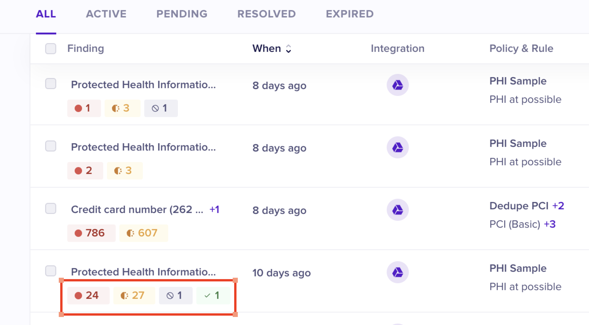
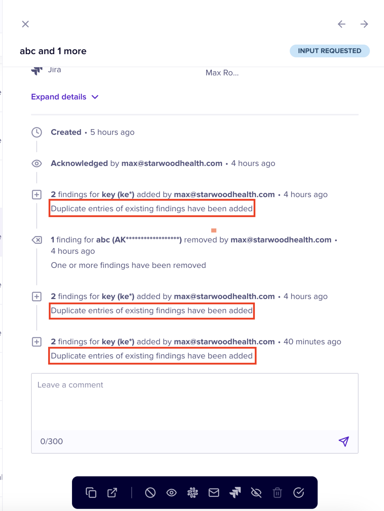
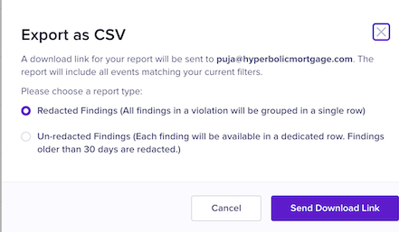

# Data Detection and Response Events

An Event is an incident that is triggered when a data leak is detected by Nightfall. The Data data detection and response (aka sensitive data protection) Events page displays all the details about the data sensitive events recorded in Nightfall from all the integrations.

Before we proceed further, let's understand what exactly is a Finding and a Event.

**Finding:** A Finding refers to a single instance of a data leak incident detected during scanning.

**Event:** An Event is an incident of data leaks, and a collection of findings that were detected while scanning an entire document or data in your database.

## Events vs Findings

When Nightfall scans data, a single Event can have multiple findings. For instance, consider that you upload a document to Google Drive. This document has 10 instances of secret information (10 API keys or 10 credit card numbers). These 10 instances are known as Findings. Since Nightfall scans the entire Google document at once, these 10 Findings are recorded as a single Event.&#x20;

## Event List View&#x20;

The sensitive data Event list view page consists of a table that displays the details of each Event. The contents consist of columns which are described as follows.&#x20;

|  Column Name  |                                                                                                                                        Description                                                                                                                                        |
| :-----------: | :---------------------------------------------------------------------------------------------------------------------------------------------------------------------------------------------------------------------------------------------------------------------------------------: |
|    Finding    |                                                          The finding displays the name of the Detector that was violated. As a result of this violation, an Event was created. A single Event entry can have multiple findings.                                                           |
|      When     |                                                                       The time elapsed (either in hours, days, weeks, months) since the Event was recorded. You can arrange this in increasing or decreasing order.                                                                       |
|  Integration  |                                                                                                                      The integration in which the Event was recorded.                                                                                                                     |
| Policy & Rule |                                                                                                                       The policy and rule names that were violated.                                                                                                                       |
|      Risk     | The risk score of the Event. When you hover on the risk score, you can view if the score was assigned automatically or calculated manually by Nightfall. For more information on Risk score, see [#risk-scoring](../../detection_platform/policies/risk_score.md#risk-scoring "mention"). |
|      User     |                                                                                                                   The user whose actions triggered the Event (finding).                                                                                                                   |
|     Status    |                                                         The current status of the Event. You can hover on the status to view the user who triggered the current status and the date and time when the current status was reached.                                                         |
| Ellipsis menu |                                                            A set of remediation actions that you can take on a Event. To view the list of actions supported in Nightfall, see [event\_actions.md](event_actions.md "mention").                                                            |

<figure><figcaption></figcaption></figure>

## Event Likelihood&#x20;

The **Finding** column displays the name of the detector whose condition was violated thus resulting in the generation of the Event. The Finding column displays a list of Events that originated from scanning a single file, a web page, or any other publicly available entity.&#x20;

Each Event's name is the same as the Detector's name whose condition was violated. You can also view the Likelihood or confidence level (Possible, Likely, Very Likely) of an Event being an actual case of data leak and also the number of instances for each Likelihood. The **Possible** Likelihood Findings are displayed in blue color with a fully dotted blue circle. The **Likely** Finding is displayed in yellow color with a half-dotted and half-shaded yellow circle. The **Very Likely** Finding is displayed in red color with a red circle.&#x20;

For instance, in the following image, a detector called Person name violated 28 times. Of these 28 instances of violations, 1 is **Possible Event** (in blue), 5 are **Likely Events** (in yellow), and 22 are **Very Likely** Events (in red).&#x20;

<figure><figcaption></figcaption></figure>

## Event Detail View

The Event detail view consists of various sections. These sections are as follows.&#x20;

### Event Detail View First Section

Each field is highlighted and a number is associated with the highlighted field. Using the number, you can refer to the section that follows the image to learn more about the field associated with that number.&#x20;

<figure><figcaption></figcaption></figure>

1 - Name of the Event

2 - Current Status of the Event. For more information on Event status, refer to the [status.md](status.md "mention") document.

3 - The nature (Credit card in the above image) and number of Findings (1 in the above image) in the Event.

4 - The name of the document in which the sensitive data was found (TEst Automation Action.Docx in the above image). If there are multiple documents that contain sensitive data, each document is listed here. However, in this case only one document contained sensitive data.

5 - The actual sensitive data found in the document (4242-4242-4242-4242 in the above image). The sensitive data is highlighted in yellow which indicates the Likelihood is **Likely**. Findings whose Likelihood are **Very Likely** are highlighted in red and Findings with Likelihood of Possible are highlighted in blue. For more information on Likelihood, see [#working-on-events](./#working-on-events "mention")document.

6 - Number of Findings in the selected document. In the above case there is only one finding and it has a Likelihood is **Possible**.&#x20;

### Event Detail View Second Section

The contents of this section vary for each integration. You can view the complete list of fields available in the second section after you click the **Expand Details** button.&#x20;

The following section contains tabs for each integration. Each tab represents an integration and contains an image of the second section followed by the description of each fields.&#x20;



The second section of the OneDrive detail view is as shown in the following image. The section after the image describes each field.&#x20;

<figure><figcaption></figcaption></figure>


The various fields in the above section are as follows.

* **Actions Taken** - The latest action taken on the Event. If no action is taken yet, this field is empty.
* **When** - The time period when the Event was registered.
* **Integration Name** - The Nightfall integration in which the Event was registered (OneDrive in this case).
* **User** - The user whose actions triggered the Event.&#x20;
* **Violated Policy** - The name(s) of the policy/policies that was violated and as a result of which the Event was triggered.
* **Detection rule** - The name(s) of the detection rule(s) within the policy that was violated.
* **Last modified by** - The name of the user who was the last person to act on the Event.
* **Last modified time** - The date and time when the Event was last modified.&#x20;
* **File name** - The name of the file that contains sensitive data.&#x20;
* **OneDrive ID** - The ID of the OneDrive that contains the file holding sensitive data. This field is only available for OneDrive Events.&#x20;
* **OneDrive Owner** - The name of the user who owns the OneDrive containing file(s) with sensitive data. This field is only available for OneDrive Events.&#x20;
* **Size** - The size of the file that contains sensitive data.&#x20;



The second section of the Google Drive detail view is as shown in the following image. The section after the image describes each field.&#x20;

<figure><figcaption></figcaption></figure>

The various fields in the above section are as follows.

* **Actions Taken** - The latest action taken on the Event. If no action is taken yet, this field is empty.
* **When** - The time period when the Event was registered.
* **Integration Name** - The Nightfall integration in which the Event was registered (Google Drive in this case).
* **User** - The user whose actions triggered the Event.&#x20;
* **Violated Policy** - The name(s) of the policy/policies that was violated and as a result of which the Event was triggered.
* **Detection rule** - The name(s) of the detection rule(s) within the policy that was violated.
* **Type** - The type of the document in which sensitive data exists.&#x20;
* **Size** - The size of the document in which sensitive data exists.&#x20;
* **Link Permissions** - The link permissions of the file in which the sensitive data exists.
* **Viewers can Download** - This is a boolean field (Yes/No) which indicates whether users can download the file that contains sensitive data.
* **File Owner** - The email ID of the user who owns the file that contains sensitive data.
* **In Trash** - This is a boolean field (Yes/No) which indicates whether file that contains sensitive data is moved to trash or not.
* **Date Created** - The date and time when the file containing sensitive data was created.
* **Date Last Modified** - The date and time when the file containing sensitive data was last modified.
* **Shared Drive Name** - The name of the shared drive in which the file containing sensitive data resides.
* **Shared With - Internal** - The list of internal users with whom the file is shared.
* **Shared With - External** - The list of internal users with whom the file is shared.
* **Last Edited By** - The email ID of the user who last edited the file that contains sensitive data.



The second section of the JIRA detail view is as shown in the following image. The section after the image describes each field.&#x20;

<figure><figcaption></figcaption></figure>

The various fields in the above section are as follows.

* **Actions Taken** - The latest action taken on the Event. If no action is taken yet, this field is empty.
* **When** - The time period when the Event was registered.
* **Integration Name** - The Nightfall integration in which the Event was registered (JIRA in this case).
* **User** - The user whose actions triggered the Event.&#x20;
* **Violated Policy** - The name of the policies that was violated and as a result of which the Event was triggered.
* **Detection rule** - The name of the detection rule(s) within the policy that was violated.
* **Event Type** - The type of the event.
* **Project Name** - The name of the project that contains the ticket with sensitive data.
* **Project Type** - The type of the project that contains the ticket with sensitive data.
* **Ticket Number** - The ID of the ticket that contains the ticket with sensitive data.
* **Site** - The URL of the JIRA site that contains the ticket with sensitive data.



The second section of the Confluence detail view is as shown in the following image. The section after the image describes each field.

<figure><figcaption></figcaption></figure>


The various fields in the above section are as follows.

* **Actions Taken** - The latest action taken on the Event. If no action is taken yet, this field is empty.
* **When** - The time period when the Event was registered.
* **Integration Name** - The Nightfall integration in which the Event was registered (Confluence in this case).
* **User** - The user whose actions triggered the Event.&#x20;
* **Violated Policy** - The name of the policies that was violated and as a result of which the Event was triggered.
* **Detection rule** - The name of the detection rule(s) within the policy that was violated.
* **Item Name -** The name of the Confluence entity that contains sensitive data.
* **Site -** The link to the Confluence site that contains sensitive data.
* **Item Type -** The type of the item that contains sensitive data.
* **Is Archived -** This is a boolean field (Yes/No). It states if the Confluence entity containing sensitive data is archived or not.&#x20;
* **Date Created -** The date and time when the Confluence entity containing sensitive data, was created.&#x20;
* **Date Last Modified -** The date and time when the Confluence entity containing sensitive data, was last modified.&#x20;
* **Labels -** The Labels attached to the Confluence entity containing sensitive data, was last modified.&#x20;
* **Space Name -** The name of the Confluence space that contains sensitive data.
* **Author Name -** The name of the user who created the Confluence entity containing sensitive data.&#x20;
* **Author Email -** The Email ID of the user who created the Confluence entity containing sensitive data.



The second section of the Confluence detail view is as shown in the following image. The image The section after the image describes each field.

<figure><figcaption></figcaption></figure>


The various fields in the above section are as follows.

* **Actions Taken** - The latest action taken on the Event. If no action is taken yet, this field is empty.
* **When** - The time period when the Event was registered.
* **Integration Name** - The Nightfall integration in which the Event was registered (Salesforce in this case).
* **User** - The user whose actions triggered the Event.&#x20;
* **Violated Policy** - The name of the policies that was violated and as a result of which the Event was triggered.
* **Detection rule** - The name of the detection rule(s) within the policy that was violated.
* **Object Name -** The name of the Salesforce Object that contains sensitive data.
* **Record -** The unique Record ID of the row that contains sensitive data.
* **Content Type -** The format of the file that contains sensitive data.
* **Event Type - The type of the event that resulted in sensitive data creation.**
* **User -** The name of the User who added sensitive data.&#x20;
* **Organization ID -** The Org ID of the Salesforce org that contains the sensitive data.
* **Organization Type -** The nature of the Salesforce org (Production/Sandbox) that contains the sensitive data.
* **Organization Name -** The name of the Salesforce org that contains the sensitive data.
* **Modified At - The date and time when the record containing sensitive data was last modified.**&#x20;



The second section of the Gmail detail view is as shown in the following image. The image The section after the image describes each field.

<figure><figcaption></figcaption></figure>


The various fields in the above section are as follows.

* **Actions Taken** - The latest action taken on the Event. If no action is taken yet, this field is empty.
* **When** - The time period when the Event was registered.
* **Integration Name** - The Nightfall integration in which the Event was registered (Gmail in this case).
* **User** - The user whose actions triggered the Event.&#x20;
* **Violated Policy** - The name of the policies that was violated and as a result of which the Event was triggered.
* **Detection rule** - The name of the detection rule(s) within the policy that was violated.
* **Send Date -** The date and time when the Email containing sensitive data was sent.&#x20;
* **Subject -** The Subject line of the Email that contains sensitive data.&#x20;
* **From -** The Email ID of the user who sent the Email that contains sensitive data.
* **To -** The Email ID(s) of the recipient user who received  the Email that contains sensitive data.
* **Cc -** The Email ID(s) of the user(s) who were included in the CC field of the Email that contains sensitive data.
* **Bcc -** The Email ID(s) of the user(s) who were included in the Bcc field of the Email that contains sensitive data.
* **Thread ID**



The second section of the Zendesk detail view is as shown in the following image. The image The section after the image describes each field.

<figure><figcaption></figcaption></figure>

The various fields in the above section are as follows.

* **Actions Taken** - The latest action taken on the Event. If no action is taken yet, this field is empty.
* **When** - The time period when the Event was registered.
* **Integration Name** - The Nightfall integration in which the Event was registered (Zendesk in this case).
* **User** - The user whose actions triggered the Event.&#x20;
* **Violated Policy** - The name of the policies that was violated and as a result of which the Event was triggered.
* **Detection rule** - The name of the detection rule(s) within the policy that was violated.
* Ticket ID
* Ticket Title
* Date Created&#x20;
* Date Updated
* User Role
* Zendesk instance
* Ticket Requestor
* Group assignee
* Agent Assignee
* Event Type
* Ticket Type
* Ticket Priority
* Ticket Status
* Ticket Followera



The second section of the GitHub detail view is as shown in the following image. The image The section after the image describes each field.

<figure><figcaption></figcaption></figure>

The various fields in the above section are as follows.

* **Actions Taken** - The latest action taken on the Event. If no action is taken yet, this field is empty.
* **When** - The time period when the Event was registered.
* **Integration Name** - The Nightfall integration in which the Event was registered (Confluence in this case).
* **User** - The user whose actions triggered the Event.&#x20;
* **Violated Policy** - The name of the policies that was violated and as a result of which the Event was triggered.
* **Detection rule** - The name of the detection rule(s) within the policy that was violated.
* **Commit Date** - The date and time when the code containing sensitive information was committed.&#x20;
* **Organization** - The name of the GitHub organization that contains the code containing data.
* **Branch** - The GitHub branch that contains the code which has sensitive data.
* **Repository** - The GitHub Repository name that contains the code which has sensitive data.
* **Repository Type** - The nature of the repository that contains the code which has sensitive data.



The second section of the Notion detail view is as shown in the following image. The section after the image describes each field.

<figure><figcaption></figcaption></figure>


The various fields in the above section are as follows.

* **Actions Taken** - The latest action taken on the Event. If no action is taken yet, this field is empty.
* **When** - The time period when the Event was registered.
* **Integration Name** - The Nightfall integration in which the Event was registered (Confluence in this case).
* **User** - The user whose actions triggered the Event.&#x20;
* **Violated Policy** - The name of the policies that was violated and as a result of which the Event was triggered.
* **Detection rule** - The name of the detection rule(s) within the policy that was violated.
* **Workspace -** The link to the Notion Workspace that contains sensitive data.&#x20;
* **Page -** The link to the Notion Page that contains sensitive data.&#x20;
* **Page Created Date -** The date and time when the Notion page containing sensitive data was created.&#x20;
* **Last updated Date -** The date and time when the Notion page containing sensitive data was last modified.&#x20;
* **Created By -** The name of the user who created the Notion page containing sensitive data.&#x20;
* **Last Edited By -** The name of the user who last edited the Notion page containing sensitive data.
* **Location -** The location of the sensitive data.&#x20;
* **Page ID -** The unique ID of the Notion page containing sensitive data.
* **Shared Externally -** This is a Boolean field (Yes/No) in dicating if the Notion page containing sensitive data is shared externally or not.&#x20;



The second section of the MS Teams detail view is as shown in the following image. The section after the image describes each field.

<figure><figcaption></figcaption></figure>

The various fields in the above section are as follows.

* **Actions Taken** - The latest action taken on the Event. If no action is taken yet, this field is empty.
* **When** - The time period when the Event was registered.
* **Integration Name** - The Nightfall integration in which the Event was registered (Confluence in this case).
* **User** - The user whose actions triggered the Event.&#x20;
* **Violated Policy** - The name of the policies that was violated and as a result of which the Event was triggered.
* **Detection rule** - The name of the detection rule(s) within the policy that was violated.
* **Team Name -** The name of the team that contains sensitive data.&#x20;
* **Team ID -** The unique ID of the team that contains sensitive data.&#x20;
* **Channel Name -** The name of the Channel that contains sensitive data.&#x20;
* **Channel Membership -** The membership of the Channel that contains sensitive data.&#x20;
* **Creation Time -** The date and time when the channel containing sensitive data was created.&#x20;
* **From -** The Email ID of the user who sent the message containing sensitive data.
* **Message Priority -**&#x20;
* **Last Edit Time -** The date and time when the message was last edited.&#x20;
* **Chat Participants -**&#x20;



The second section of the Slack detail view is as shown in the following image. The section after the image describes each field.

<figure><figcaption></figcaption></figure>


The various fields in the above section are as follows.

* **Actions Taken** - The latest action taken on the Event. If no action is taken yet, this field is empty.
* **When** - The time period when the Event was registered.
* **Integration Name** - The Nightfall integration in which the Event was registered (Confluence in this case).
* **User** - The user whose actions triggered the Event.&#x20;
* **Violated Policy** - The name of the policies that was violated and as a result of which the Event was triggered.
* **Detection rule** - The name of the detection rule(s) within the policy that was violated.
* **File Name -** The name of the file that contains sensitive data.&#x20;
* **File Type -** The type of the file that contains sensitive data.
* **Location  -** The name of the channel that contains sensitive data.&#x20;
* **Channel Type -** The type of the channel that contains sensitive data.
* **Members -** The number of members that are present in the Channe&#x6C;**.**




### Event Detail View Third Section

The third section contains Event logs and comments. These sections are highlighted in the following image.

<figure><figcaption></figcaption></figure>

* **Event logs** - The event logs section contains a log of activities performed on the Event. By default, the first log activity recorded is the Event creation activity. The next set of activities generally provide information about Event notifications sent via various notification channels and actions taken on the Event.&#x20;
* **Comments** - The comments section allows you to enter comments on the Event. The maximum character limit for the comment is 300.

## Working on Events

If a single scanned entity (file or web page) violates multiple detector rules, Nightfall displays the list of all the detectors that the finding has violated. Such Events are displayed with a detector name, followed by a **+1** (if two detectors are violated), **+2** (if three detectors are violated), and so on, on the Event List view.&#x20;

In the following image, you can see that the Finding has violated a detector called Credit card number and also another detector. Hence a **+1** is displayed.&#x20;

<figure><figcaption></figcaption></figure>


In the above case, if the Finding violated three detectors, **+2** is displayed. If the Finding violated 4 detectors, **+3** is displayed.


To view the list of detectors violated and the Likelihood (Possible, Likely, and Very Likely) of each finding discovered in the file, click the Event. This opens the Event detail view. You can view the names of the violated detectors and the number of findings on the Event detail view.&#x20;

In the following image, a single file **Automated upload 1728418320** has violated three detectors. The detectors are **Person name, Tom Cruise with Exclusions** and **Phone number**. The **Person name** detector has been violated 22 times and hence there are 22 findings for this detector. You can view each of these 22 instances of findings by clicking the **22 Person name** tab and scrolling down. The findings that are highlighted in Blue are **Possible** findings, findings highlighted in Red are **Most Likely** findings, and the findings highlighted in yellow are **Likely** findings. There is a **Showing** field which displays the number of Findings and the likelihood of each finding. In the following image, the **Showing** field displays 22 in red. It implies that all 22 findings have the **Most Likely** likelihood.

<figure><figcaption></figcaption></figure>

The **Tom Cruise with Exclusions** detector has 3 findings. You can view the Likelihood of each of the 3 findings. You can view the findings that violated this detection rule by clicking the **3 tom cruise with exclusions** tab.&#x20;

<figure><figcaption></figcaption></figure>

Similarly, you can click the 3 Phone Number to view the details of the findings that violated the **Phone number** detector.

## Annotating Findings

As learned above, a Event can have multiple findings. If you find that any of the findings discovered by Nightfall is not an actual case of data leak, you can use the **Annotate** feature to annotate the specific finding as a false positive. Furthermore, you can also annotate those findings, which surely are a case of data leak, as true positives. Each finding has the annotate option.

To annotate a finding:

1. Hover the mouse on the finding that you wish to annotate.
2. Click the annotation icon.

<figure><figcaption></figcaption></figure>

3. Select one of the following annotation options.&#x20;

* **Not a Credit card number:** Select this option if you feel that the Credit card number discovered by Nightfall is not a credit card number but some other number. This marks the finding as a False positive.
* **Not a violation**: Select this option if you feel the finding discovered by Nightfall is not a violation (an imaginary credit card number shared publicly as an example). This marks the finding as a False positive.
* **True Positive:** Select this option if you feel that the finding discovered by Nightfall is an actual case of data leak. This marks the finding as True positive.

4. (Optional) Enter comments for annotation.
5. (Optional) Turn the **Apply to all identical findings** toggle switch to annotate all the similar findings. Click [#bulk-annotate](./#bulk-annotate "mention") to learn more about this feature.
6. Click **Apply**.&#x20;

<figure><figcaption></figcaption></figure>


In step 3, of the above task, you see three options for annotation. The name of the first option depends on the nature of the Finding. For instance, if the sensitive data found is a suspected API key, the option name changes to **Not an API key.** If it is a Personally Identifiable Information (PII), the option name changes to **Not a Personally Identifiable Information**, and so on.


When you annotate a finding as **Not a credit card**, **Not an Address**, and so on, or annotate a finding as **Not a** **Violation,** the Finding is displayed as **False Positive** on the Finding column. If you annotate a Finding as **True Positive**, it is displayed as **True Positive** on the Finding column.&#x20;

In the following image, a Violation has 25 **Very Likely** Findings and 28 **Possible** Findings. We annotate a **Very Likely** Finding as **True Positive** and a **Possible** Finding as **Not a Violation**. You can see that the values are reflected accordingly. Findings annotated as **True positive** are displayed in green color and Findings annotated as **False Positive** are displayed in grey color.

<figure><figcaption></figcaption></figure>

The Finding column also reflects the latest data on each finding. You can view that **Very Likely** Findings has reduced to 24. This is because one of them is annotated as **True Positive**. Similarly, **Likely** findings have reduced to 27. This is because one of them is annotated as **False Positive**.

<figure><figcaption></figcaption></figure>

If you accidentally annotate a Finding or annotate a Finding incorrectly, Nightfall provides remediation measures too. For accidentally annotated Findings, you can revert the annotation to return to the original Likelihood (Possible, Likely, Very Likely). For incorrectly annotated findings, you can modify the annotation.&#x20;

<figure><figcaption></figcaption></figure>

### Bulk Annotate

When the Apply to all identical findings toggle switch is enabled, the following events occur.

* annotation is applied to all exact matches of the finding in all the existing Events.
* annotation is applied to all exact matches of the findings in new Events.

Furthermore, the Nightfall AI Smart Auto-Ignore feature performs the following tasks.

* Events whose 100% of findings are annotated as false positives are automatically ignored.
* When auto-ignored, an entry is added to the Event activity log for visibility
* Auto-ignored Events are updated to "Ignored" status and moved to the "Resolved" tab for visibility, analysts' review, or audit.


**Undo Auto-Ignore**\


* Undo is an action available on any Event that has been automatically ignored by Nightfall AI.
* Taking the undo action reverts the status of the selected Event back to the pre-ignore state.



&#x20; **Undo Annotation and Disable Automatic Annotation**


* The annotation for a specific token/finding can be undone by reverting the annotation (no change from current behavior).
* When edited the "apply to all..." flag can be disabled.  When disabled, future instances of the exact finding will not be automatically annotated.


### View Event Details

You can also find more details about the Event from the Event detail view. By default, only a few details are displayed on the Event detail view. You must click the **Expand details** button to view all the details of the Event. You can also view the chronological order of events (annotations applied, reverted, Event resolved, and so on) on the Event. The events start from the date on which the Event was created. You can also add comments on the Event.

<figure><figcaption></figcaption></figure>

## Apply Actions on Events

You can also apply various actions on the Events. The actions menu displays a list of actions that you can perform on an Event.&#x20;

To learn more about Event actions, you can view the [event\_actions.md](event_actions.md "mention") document.&#x20;

## Bulk Actions

When you wish to implement an action on multiple Events simultaneously, you can use the bulk action feature. To learn more about how to use this feature, refer to the [bulk\_actions.md](bulk_actions.md "mention") document.&#x20;

## Filtering Data

Nightfall provides you with various filters to view Events specific to an integration, User, or Status. This ensures that you view data that is specific to your requirements. The various filters are described as follows.&#x20;

### Historic Data Filter

This filter allows you to view historical data. You can choose to view data for the last 7, 30, 90, 120, or 180 days. You can also select a custom date range by entering the date in the MM/DD/YY format. When you apply a specific period, all the data on the Event management page is fetched from the selected period till the current date. For instance, assume that the current date is 1 December 2023. If you select the time filter as Last 7 days, the data is displayed from 25 Nov 2023 to 1 December 2023. Similarly, if you select the time filter as last 30 days, the data is displayed from November 2, 2023, to December 1, 2023. By default, this filter displays the data for the **Last 7 days**. You can click the Last 7 Days button to edit the date.&#x20;

<figure><figcaption></figcaption></figure>

### Miscellaneous Filters

The miscellaneous filters allow you to apply filters on various Nightfall entities. The entities are described as follows.&#x20;

#### Detector

This filter facilitates you to view Event data specific to a Detecter.&#x20;

#### Integration

This filter facilitates you to view Event data specific to an Integration&#x20;

#### Likelihood

This filter facilitates you to view Event data specific to the Likelihood of sensitive data being detected.

#### Status

This filter facilitates you to view data specific to the status of Event&#x20;

#### User

This filter facilitates you to view data specific to users who triggered Events.

To apply a filter:

1. Click the **Filter** button.
2. In the **When** drop-down menu select a filter.

<figure><figcaption></figcaption></figure>

**Note**: The **Select an Option** drop-down menu is activated once you select a filter. The options in the drop-down menu vary for each filter selected.

3. Select a filter value from the **Select an Option** drop-down menu. For some filters (like integration filter), you can select multiple values.

<figure><figcaption></figcaption></figure>

3. (Optional) Click Add Filter to add multiple filters.
4. (Optional) Repeat steps 2-3 to add multiple filters.&#x20;
5. Click **Apply**.


* You can add multiple filters. Nightfall allows you to add a maximum of five filters.
* When you add multiple filters, logical AND operation is applied between the filters. As a result, only the data that matches all the applied filters is displayed. &#x20;
* To remove the miscellaneous filters, click the **Reset** button.


## Automated Event Duplication Management

If an Event is reported multiple times, Nightfall updates the Event to the new instance, instead of creating new Events. However, it maintains a trail of the Events to ensure no reporting is lost.

Filtering duplicates reduces alerts. It also saves you the time spent on analyzing each finding.

Nightfall filters duplicate findings in multiple ways. New Events are not created when:

* You remove a previously reported finding. The existing Event is updated. You can view the update in the Event metadata.
* a duplicate of a finding previously reported is added. The existing Event is updated.

<figure><figcaption></figcaption></figure>

**Note:** Filtering duplicate Events is currently available for Jira and Confluence.

An Event is auto-resolved:

* When you remove all reported findings.
* When you delete a resource (ex. ticket, comment, or page).

### Examples

Consider the case of JIRA integration. If Nightfall detects a data Event in either your JIRA ticket description or JIRA ticket comments an Event is created. This Event has a single finding which was detected in the JIRA ticket. You can view the history of this Event as highlighted in the following image.&#x20;

<figure><figcaption></figcaption></figure>

Now, consider that you add more sensitive data in the ticket. When Nightfall scans the ticket again the following events occur

* A new Event is created with a single finding. This finding refers to the new sensitive data detected during the second scan.
* The previous Event record is updated. It now has two findings (even more than two if multiple findings are detected on the same ticket).&#x20;

You can now find the duplicate ticket information in the ticket history section.

<figure><figcaption></figcaption></figure>


## Searching Events

The search bar in Events allows you to search Events in two ways as described in the following sections.

### Keyword Based Search

You can search for Events using a keyword. The search returns all Events that contain all the keywords submitted.&#x20;

* For instance, searching for a Credit Card returns all Events that contain Credit AND Card in any of the indexed Event properties.
* You can search for an exact phrase. Use double quotes around the phrase (ex."Credit Card Number").
* Use the AND to search for Credit Card Number Events by John Doe (ex. "Credit Card Number" AND "John Doe")
* Use the Not operator to exclude Events from your search query (ex."Credit Card Number" AND "John Doe" NOT Confluence)

### Operator Based Search

Nightfall provides you with search operators to search for the exact Event required. A search operator is an entity that you can use as a filtering factor. For instance, **Detector\_name** is an operator that you can use to view Events specific to a detector. Similarly, Confidence is an operator that you can use to filter Events based on confidence levels (Very Likely, Likely, Possible).&#x20;

You can use an operator as shown in the following image.

<figure><figcaption></figcaption></figure>

You can see that when you search for Events with **Likely** Confidence, the search returns all the Events in which at least one instance of **Likely** Finding. Similarly, when you search for **Possible** Confidence, the search returns all the Events that have at least one instance of **Possible** finding.

Nightfall also displays the last five search terms for each user. These values are stored in the user's browser cache.

Nightfall provides two types of search operators.&#x20;

* **General Search Operators**: These operators are based on Nightfall entities. These can be confidence level, Nightfall actions, Event status, and so on. To view the complete list of general search operators, see [#general-operators](filter_operators.md#general-operators "mention").
* **Integration Search Operators**: These are the search operators based on specific integrations. These operators vary for each integration. To view the complete list of integration-based search operators, see [#integration-operators](filter_operators.md#integration-operators "mention").

You can use multiple operators to refine your search. When you use multiple operators, Nightfall applies the AND logic between the operators. So, if you wish to view all the active Events in the Zendesk integration, you can accomplish it as shown in the following image.&#x20;

<figure><figcaption></figcaption></figure>

You can also use a single operator to filter multiple values. For instance, to view all the Events of Zendesk and Salesforce integrations, you can use the search as shown below.

```
integration_name:"Zendesk" OR "Salesforce"
```

<figure><figcaption></figcaption></figure>


**Note**

&#x20;**`:`**  is used as an operator delimiter for search as so  **`:`**  cannot be used as a search string. If you wish to search a text with **`:`**  colon in it,  replace it with `?`  or  `*`  and submit the query, else the prefix to colon would be considered an operator.


### Special Characters

While **`:`** is a special character that is an operator seperator for search actions, there are other special characters that cannot be used directly in the search bar. The complete list of special characters that cannot be searched directly, are as follows.

```
+ - && || ! ( ) { } [ ] ^ " ~ * ? \
```

So, if your policy name contains reserved characters like && {}, you cannot use these characters directly in the search bar. You must make some changes to your search query before using them. To search any of the above special characters, you must perform any one of the following tasks:

* Use an escape character \ before the special character (_this will work with all special characters but not with_ **`:`** )
* Replace the special character with the wildcard (\*).
* Replace the special character with a question mark (?).

Some of the examples are as follows.

* To search the policy name `Google Drive! Critical_Document`_,_ you must use one of the following search terms.

```
policy_name:"Google Drive? Critical_Document"

policy_name:"Google Drive* Critical_Document"

policy_name:"Google Drive\! Critical_Document"
```

* To search the policy name `H&&M,` you must use one of the following search terms.

```
policy_name:"H?&&M"

policy_name:"H*&&M"

policy_name:H\&\&M"
```

*   To search the policy name `Google !`,  you must use one of the following search terms.\


    ```
    policy_name:"Google *"

    policy_name:"Google ?"

    policy_name:Google \!"
    ```

## Export and Share Event Data

Nightfall allows you to share and download the Event data. The Share option creates a link to the current view with all the filters applied. When you click this link,the Events page opens with all the filters applied. &#x20;

<figure><figcaption></figcaption></figure>

The Export option, creates a CSV file with all the event data. The CSV file is mailed to the logged in user's Email ID. The CSV file contains all the filters which were applied before initiating the download process. Click **Export to CSV** to start the export process.

&#x20;&#x20;

<figure><figcaption></figcaption></figure>

Once you click **Export to CSV**, a pop up window is displayed. You can select one of the following options and click **Send Download Link.**

* **Redacted Findings**: In this report, all the findings of an Event are grouped in a single row. The report is available only for 24 hours, once delivered. You cannot access the report after 24 hours.
* **Un-redacted Findings**: Users with [System administrator](https://help.nightfall.ai/sensitive-data-protection/nightfall_settings/role_based_access_control#roles-and-permissions) role can view un-redacted findings by selecting this option. Only those findings that are not older than 30 days can be viewed in un-redacted format. Findings older than 30 days are redacted. In this report, each finding is available in a separate row. The report is available only for 24 hours, once delivered. You cannot access the report after 24 hours.&#x20;

<figure><figcaption></figcaption></figure>

You receive an Email from Nightfall with the subject line **Nightfall - Report \<Download date>.** You must click the **Download Report** button in the email. The link to the report expires 7 days after you receive the email.

&#x20;The CSV table contains the same columns as in case of the Event list view. The file looks as follows.&#x20;

<figure><figcaption></figcaption></figure>
