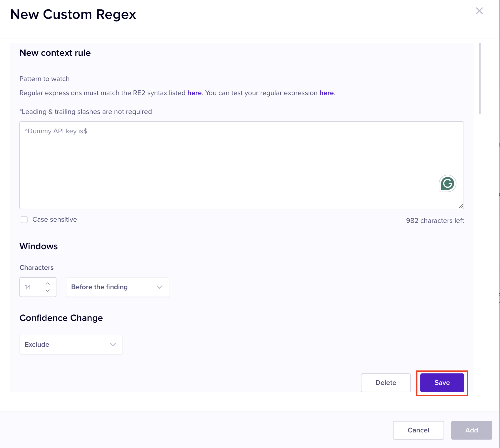

# Create Regular Expression Detector

A regular expression detector allows you to define a regular expression pattern. Once you define a pattern, Nightfall scans your data to check if there is anything that matches the given pattern. If a match is found, it is flagged as sensitive data. You can also refer to [this link](https://regex-generator.olafneumann.org/?sampleText=2020-03-12T13%3A34%3A56.123Z%20INFO%20%20%5Borg.example.Class%5D%3A%20This%20is%20a%20%23simple%20%23logline%20containing%20a%20%27value%27.\&flags=i) to generate regular expressions.&#x20;

## Understanding Context Rules and Exclusion Rules

To use the Regular Expression detector effectively, Nightfall provides you with two special rules; **Context Rules** and **Exclusion Rules**. When Nightfall scans your data and finds some sensitive data, these rules are used to further scrutinize the sensitive data to be sure that the data is sensitive. Context rules and Exclusion rules are optional and you can define them only if you wish to have added filtration on sensitive data to be sure that data that is termed as sensitive, is sensitive.&#x20;

Context rules are a set of hot and cold words that help Nightfall to effectively identify sensitive data.  &#x20;

Exclusion rules define specific scenarios in which data flagged by a detector should be excluded from the list of findings.

You can find these rules in the Regular Expression detector. You must click **+ Rule** to create a Context rule or Exclusion rule.

<figure><figcaption></figcaption></figure>

### **Context Rules**&#x20;

Context rules help Nightfall identify sensitive data by providing data about the text surrounding sensitive data. You can define a regular expression pattern to match the data that usually surrounds sensitive data. You can then instruct Nightfall as to where this surrounding data can be generally found. It can be found before sensitive data, after sensitive data, or both before and after sensitive data. You can also define confidence level settings when a match is found.&#x20;

For example, credit card data is sensitive data. If a user shares it accidentally online, then they generally draft the following phrases before disclosing the credit card number.&#x20;

```
my credit card details are

my credit card number is

Please find below my credit card details

My credit card number is as follows
```

&#x20;After disclosing the credit card information, users generally draft the following messages.

```
Please find my credit card details above

I have shared my credit card details

Shared my credit card details. Please do the needful

As requested, shared my credit card details. Let me know if you need any further 
details
```

Context rules involve creating regular expressions to define these types of phrases that surround the sensitive data. You can use [this link](https://regex-generator.olafneumann.org/) to generate regular expressions to define data that surrounds sensitive data. You can define the Context rule regular expression in the **Pattern to match** text box.&#x20;

You can also choose to make your regular expression case-sensitive by selecting the **Case sensitive** check box.&#x20;

<figure><figcaption></figcaption></figure>


The terms "Finding" and "Sensitive data" are synonyms to each other. &#x20;


**Windows Setting**: Once you create the regular expression to define the possible phrases that can surround the sensitive data, you can use the Windows setting to instruct Nightfall as to where exactly this surrounding text can exist around the sensitive data (before, after). Nightfall provides you the following Windows settings.

* **Before the finding**: You can use this setting to define the number of characters before the prospective sensitive data at which surrounding text can be found. \
  \
  For example, if you define this setting as 20 characters before the finding, and if Nightfall detects the prospective sensitive data on line 4 column 60, it looks at the data on line 4 and from column 40 to check if it matches the defined regular expression for Context rules.
* **After the finding**: You can use this setting to define the number of characters after the prospective sensitive data at which surrounding text can be found. \
  \
  For example, if you define this setting as 20 characters after the finding, and if Nightfall detects the prospective sensitive data on line 4 column 60, it looks at the data on line 4 and from column 60 to check it that matches the defined regular expression for Context rules.
* **Before or after the finding**: You can use this setting to define the number of characters before or after the prospective sensitive data at which surrounding text can be found. \
  \
  For example, if you define this setting as 20 characters before or after the finding, and if Nightfall detects the prospective sensitive data on line 4 column 60, it looks at the data on line 4 and from column 60 and also on data at line 4 from column 40 to check it any of the two match the defined regular expression for Context rules.

<figure><figcaption></figcaption></figure>

**Confidence Change**: If Nightfall finds any data to be sensitive and if this prospective sensitive data matches the Context rules as well, you can then define Confidence change settings to instruct Nightfall on what to label this prospective sensitive data. Nightfall provides you with four Confidence change settings&#x20;

* **Exclude**: If you set the Confidence Change setting to **Exclude**, Nightfall does not consider the prospective Finding to be actually sensitive (even though it matched both; sensitive data's regular expression and also the Context rules' regular expression and Windows setting) and excludes it from Findings. You can use this setting to eliminate false positive findings.\
  \
  For example, consider that one of your prospective customer is testing your API and you need to share an API key for this testing. You share a dummy API key and do not wish this API key to be flagged as sensitive data. You can ask your employees to draft a specific phrase before sharing the API key (something like, _the dummy API key is_ ). You can then define a context rule for this phrase, set the Windows setting to define where exactly it can be found, and then set **Exclude** as the Confidence change setting, to exclude this dummy API key from being flagged as sensitive data.&#x20;
* **Possible**: If you set the Confidence Change setting to **Possible**, Nightfall classifies the prospective finding as an actual sensitive data and this finding is logged on the [sdp\_events](../../dashboard/sdp_events/ "mention") page as a **Possible** finding (around 20-30% chance of data actually being sensitive in nature).\
  \
  For example, in the above scenario for the **Exclude** option, if you wish to get notifications even for dummy APIs, to ensure that your employees might have not shared an actual API key instead of a dummy key, you can use the **Possible** setting. This setting logs the finding on the Violations page as **Possible** finding. You can check the finding on the Violations page and if its dummy API key, and not a live API key, you can set it to Ignore the finding from the Violations page. &#x20;
* **Likely**: If you set the Confidence Change setting to **Likely**, Nightfall classifies the prospective finding as an actual sensitive data and this finding is logged on the [sdp\_events](../../dashboard/sdp_events/ "mention") page as a **Likely** finding (around 50-60% chance of data actually being sensitive in nature).\
  \
  For example, consider the scenario described above for the **Exclude** option. If you feel that sometimes your employees may share a dummy API key with prospective customers without using the mandatory phrase (_the dummy API key is)._ In such cases, you they might have used some other phrases. You cannot really be sure if they transmitted dummy API keys or shared live API keys. In such cases, you can set the Confidence to be **Likely (**&#x35;0-60% chance of data actually being sensitive). Nightfall logs it as a Finding in the Violations page with **Likely** confidence level. You can view the Violations page, verify this Finding which is tagged as **Likely** and take appropriate actions based on whether the data is actually sensitive or not.&#x20;
* **Very Likely**: If you set the Confidence Change setting to **Very** **Likely**, Nightfall classifies the prospective finding as an actual sensitive data and this finding is logged on the [sdp\_events](../../dashboard/sdp_events/ "mention") page as a **Very** **Likely** finding (around 80-90% chance of data actually being sensitive in nature).\
  \
  For example, consider the scenario described above for the **Exclude** option. Apart from the dummy API key there are lots of sensitive data in your organization. If an employee accidentally shares such information, they generally use phrases like _our organization's API keys are, our API OAuth key is,_ _the password is_... and so on. You can create a regular expression for all such phrases, define the Window settings for them and then set the Confidence level as **Very Likely.** Nightfall logs such findings on the Violations page as **Very Likely** findings (80-90% chance of data actually being sensitive). You can navigate to the Violations page and take appropriate actions. &#x20;

Once you create the regular expression for Context rule, define the Windows setting and the Confidence Change settings, you must click **Save** to create the context rule.&#x20;

<figure><figcaption></figcaption></figure>

Once you save the Context rule, you can see that Nightfall creates a sentence which defines the summary of your Context rule. You can choose to edit or delete the rule, if required.&#x20;

<figure><figcaption></figcaption></figure>

### **Exclusion Rules**

Exclusion rules specify data that is not sensitive in nature (false positive findings). If you feel that Context rules cannot help you to stop false positive findings being logged, you can use Exclusion rules. You can also use Exclusion rules and also Context rules together to eliminate the possibility of getting false positive findings.&#x20;

Nightfall provides you four methods by which you can define Exclusion rules.

<figure><figcaption></figcaption></figure>

#### Regex

You can use Regex method and define a regular expression. If a prospective sensitive data matches the defined regex, it is immediately excluded from being considered as a Finding. Nightfall also allows you to match either the whole regular expression or partial regular expression. You can use [this link](https://regex-generator.olafneumann.org/) to generate regular expressions.

For example, consider that one of your prospective customer is testing your API and you need to share an API key for this testing. You create a series of dummy API keys (say ABCD1234, ABCD2345, ABCD3124, ABCD5412, and so on). You can create a regular expression to match each of these dummy APIs and select the **Full match** option. Nightfall does not treat any of these as sensitive data and excludes them.&#x20;

<figure><figcaption></figcaption></figure>

You can observe that all the API keys start with the term ABCD. In such cases, you can use the **Partial match** option and just define regular expression for any one of the API keys. This is helpful if you have hundreds of dummy APIs, which have some common data between them. You need not create a regular expression for each of them.&#x20;

<figure><figcaption></figcaption></figure>

Since all the dummy APIs start with ABCD, if Nightfall detects any of these API keys, it straight away excludes them. In this case, you must ensure that none of the live APIs have the term ABCD in them.&#x20;

#### Dictionary

If you are facing a hard time creating regular expressions for content that needs to be excluded, you can use the dictionary option. This option allows you to define phrases that must not be considered as sensitive data. You can use this option to directly define commonly used passwords, dummy API keys, and so on.&#x20;

The Dictionary exclusion rule has three options.

* **Manual Entry**: In this option you can directly enter the password or API key to be excluded and press enter. You can add multiple items (need not have any delimiter). You can choose to match the string partially or fully.

<figure><figcaption></figcaption></figure>


* **Existing Dictionary**: In this option, you can choose an existing Dictionary detector as the exclusion token. When you select the Existing Dictionary option, a new drop-down menu is displayed. You can select any of the previously created dictionary detector.&#x20;

<figure><figcaption></figcaption></figure>

* **Upload Dictionary:** With this option, you can upload a new dictionary. The process is same as in case of dictionary detector. You can refer to the [dictionary\_detector.md](dictionary_detector.md "mention") document for details.&#x20;

<figure><figcaption></figcaption></figure>

#### File Type&#x20;

The File Type exclusion rule allows you to exclude a specific file type. If Nightfall finds that the prospective sensitive data is part of one of the file types defined in this section, it excludes it.&#x20;

File type provides you two options.&#x20;

* &#x20;**New File Type**: This option allows you to define new file type(s) that must be excluded.

<figure><figcaption></figcaption></figure>

* **Existing Custom Detector**: This option allows you to use a File Type Detector created previously as the exclusion token. When you select this option, a new drop-down menu is displayed which consists of the list of previously created File type detectors. You can select the required detector.&#x20;

<figure><figcaption></figcaption></figure>

#### Known Files

This option allows you to upload a file with all the data that you feel is not sensitive. Nightfall checks if any of the prospective findings match the data in this file. If a match is found, the data is not considered to be sensitive and excluded from Findings. You can also upload an existing File Fingerprint detector as the input token.

There are two options in this rule.&#x20;

* **Upload New File**: This option allows you to upload a new file.&#x20;

<figure><figcaption></figcaption></figure>

* **Existing Custom Detector**: This option allows you to use a previously created custom File Fingerprint detector.&#x20;

<figure><figcaption></figcaption></figure>

## Create Regex Detector

You can execute the following steps to create a Regex detector.

1. Navigate to the Detectors section from the left pane.
2. Click **+ Custom Detector** and select **Regular Expression**.
3. Enter a name for your custom Detector in the **Name** field.&#x20;
4. (Optional) Enter a description for the Detector in the **Description** field.
5. Enter the Regular expression pattern in [RE2 Syntax](https://github.com/google/re2/wiki/Syntax/), in the **Regex** field.&#x20;
6. (Optional) Select the **Case sensitive** check box if you wish to match case sensitive pattern.&#x20;
7. (Optional) Click **+ Rule** under the **CONTEXT RULES** section and define regular expression pattern for Context rule.
8. (Optional) Click **+ Rule** under the **EXCLUSION RULES** section and define regular expression pattern for Exclusion rule.
9. Click **ADD**.

<figure><figcaption></figcaption></figure>
