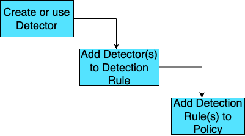

# Overview

Nightfall detection platform looks for sensitive data. When sensitive data is detected, a notification or automated remediation action is initiated. The detection platform consists of three components; **Detectors**, **Detection Rules**, and **Policies**.&#x20;

A **Detector** is an entity that can detect the presence of sensitive data in publicly exposed entities. You can either use the default detectors provided by Nightfall or create your custom detectors.&#x20;

A **Detection rule** is a group of detectors. Once you create your detectors or finalise the Nightfall detectors you wish to use, you can add them to a detection rule. You can customize the degree of weightage for each detector in a detection rule.

Once you finalize the creation of detection rules, you can add them to policies. A **Policy** consists of multiple detection rules. When a detector in any of the detection rules detects sensitive data, the Policy can trigger auto notifications to be sent to specific users, initiate automated remediation measures, and allow end-users to take remediation actions.  &#x20;

So, a Detector or a Detection rule do not have the ability to trigger alerts or take remediation steps by themselves, you need to add them to a policy.&#x20;

The following diagram shows how you can leverage the three entities of the Nightfall Detection platform.&#x20;

<figure><figcaption></figcaption></figure>

