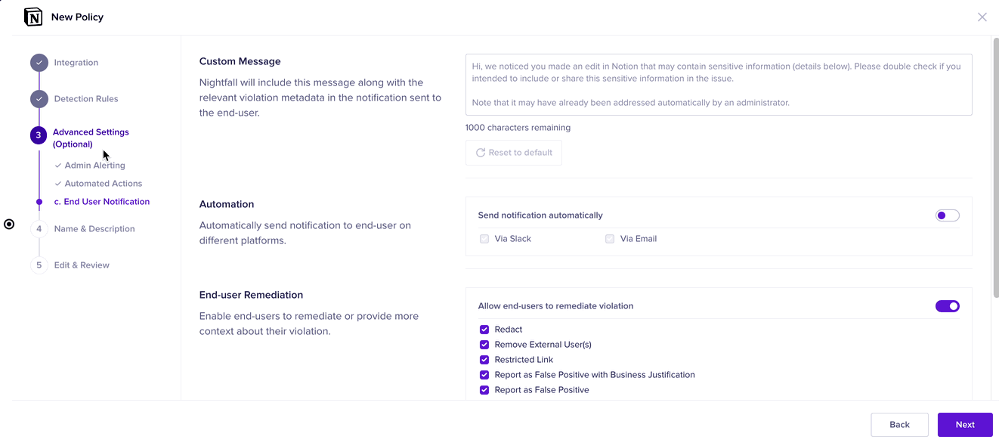

# Advanced Settings

This stage is optional. This stage allows you to configure notification alerts, automated actions, and end-user actions. This stage has three components. Before we proceed further, you need to understand the following terms.&#x20;

* **Admin**: These are the users in your organization who work on Nightfall. These users configure integrations, create Policies, monitor Dashboards and Violations, and perform other actions in the Nightfall console. These users can be called Nightfall administrators.
* **End-User**: These are the users who do not work on the Nightfall console but work on other SaaS applications in your organization. These users can be the members of your software development teams, QA engineers, network administrators, and so on. End-users are more prone to leaking sensitive data from your organization.

The Advanced Settings stage has the following components.&#x20;

## Admin Alerting

In this stage, you can configure notifications. The Nightfall admin receives the notifications configured in this stage. The various notification channels available are as follows.&#x20;

* **Slack Alerts**: You can configure Slack as a notification channel. When you configure Slack as an alert channel, admin users get a notification each time the policy has been violated. To learn more about configuring Slack as an alert channel in policies, see [this document](https://help.nightfall.ai/nightfall-ai/detection/setting-up-slack-as-an-alert-channel-in-nightfall#_l6ppz15uwzsh).
* **JIRA alerts**: You can configure JIRA as an alert platform for policies. When the policy is violated a new JIRA ticket is created in the JIRA project of the JIRA instance selected by you and the Nightfall admin receives a notification in JIRA for the creation of the new ticket. You can refer to the [alerting\_to\_jira.md](../../nightfall_alert_platform/alerting_to_jira.md "mention") to learn more about using the alert platform.
* **Email Alerts**: You can configure Email notifications and enter the Email IDs of the Nightfall admin users. The admin users receive an email when the policy is violated.
* **Webhook Alerts**: You can configure Webhook as an alert platform. You can refer to [this document](https://help.nightfall.ai/nightfall-ai/operationalizing-dlp/integrating-with-security-tools/integrating-with-siem#configuring-outgoing-webhooks) to learn more about webhook configuration.&#x20;

## Automated Actions

The Nightfall automated actions are neither performed by the Nightfall admin nor the end-users. They are triggered automatically when a violation is detected. Nightfall admin only needs to enable the automated actions. Automated actions are not present in all the integrations. Nightfall admins can either choose to trigger automated actions immediately when a Nightfall is detected or after some time.&#x20;

The various automated actions are described as follows.

* **Redact**: This action redacts the sensitive data that caused the violation. Admins can choose to implement this action either immediately when the violation is detected or after some time.&#x20;
* **Delete Attachment**: This action deletes the attachment that contains sensitive data. Admins can choose to implement this action either immediately when the violation is detected or after some time.&#x20;
* **Remove Access**: This action revokes public access to the page that contains sensitive information and makes it private or revokes page access to guest users (external users who are not part of your organization. Admins can choose to implement this action either immediately when the violation is detected or after some time.&#x20;


As mentioned above, all the integrations do not have automated actions. Furthermore, not all the automated actions are supported by all the integrations. For instance, the **Remove Access** action is only present in the Notion integration.&#x20;


<figure><figcaption></figcaption></figure>

## End-User Notification

The settings configured by the Nightfall admin in this stage send notifications to end-users (users whose actions triggered violation). Furthermore, end-users can also take remediation actions (human firewall) from within the notifications, provided the Nightfall admin configures the required settings.

&#x20;This stage has the following configurations.

* **Custom Message:** In this section, you can draft a custom 1000-character violation message to be sent to end-users. By default, Nightfall provides you with a violation message. You can use it or draft your custom message.
* **Automation:** This section allows you to choose the notification channel through which the above message must be sent. Slack and email are some of the supported channels. The channels vary for each integration.&#x20;
* **End-user Remediation (Human Firewall):** In this section, Nightfall admins can configure remedial actions that end-users can take when they trigger a violation. The available actions vary for each integration. If end-users do not perform any of the remediation actions after triggering a violation, Nightfall admins can set reminders and also the frequency at which the reminders must be sent.&#x20;

<figure><figcaption></figcaption></figure>


The alert methods you set up in the [#admin-alerting](advanced_settings.md#admin-alerting "mention") and [#end-user-notification](advanced_settings.md#end-user-notification "mention") sections apply only to the specific policy on which they are configured. To configure the alerts on all the policies of integration, you must set up the alerts at the integration level.&#x20;

