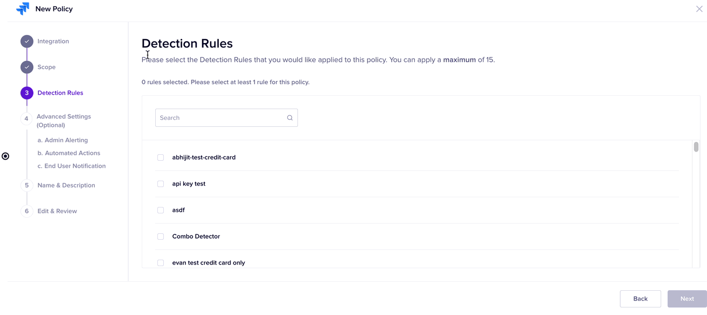

# Detection Rules

This stage allows you to select detection rules to be included in the policy. The policy uses the detectors present in the detection rules to scan your data and check if there is any data leakage. You must include all the required detection rules in this section. You can select a maximum of 15 detectors in a single policy. You can use the search bar to search for a detection policy.

You must first select the required detection rule(s). Once you select the rule(s), you can set one of the following options.&#x20;

* **All Detection Rules**: This option displays all the detection rules in the policy, irrespective of the rules selected by you.
* **Selected Detection Rules**: This option displays only those detection rules in the policy, that you have selected. If you move to the next stage, only the selected detection rules are included in the policy.
* **Unselected Detection Rules**: This option displays only those detection rules that you have not selected. You can still select any of the detection rules and even those will be excluded from the policy.&#x20;

In the following image, you can view the search bar in Detection rules. You can see that:

* When you select the **All Detection Rules** option, all the rules are displayed.&#x20;
* When you select the **Selected Detection Rules** option, only those detection rules are displayed that you have selected and only these rules will be used in the policy.&#x20;
* When you select the **Unselected Detection Rules** option, only those detection rules are displayed that you have not selected. You can still select any of the detection rules and even those will be excluded from the policy.&#x20;

<figure><figcaption></figcaption></figure>
