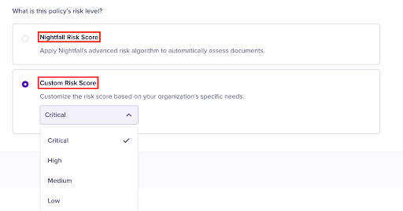
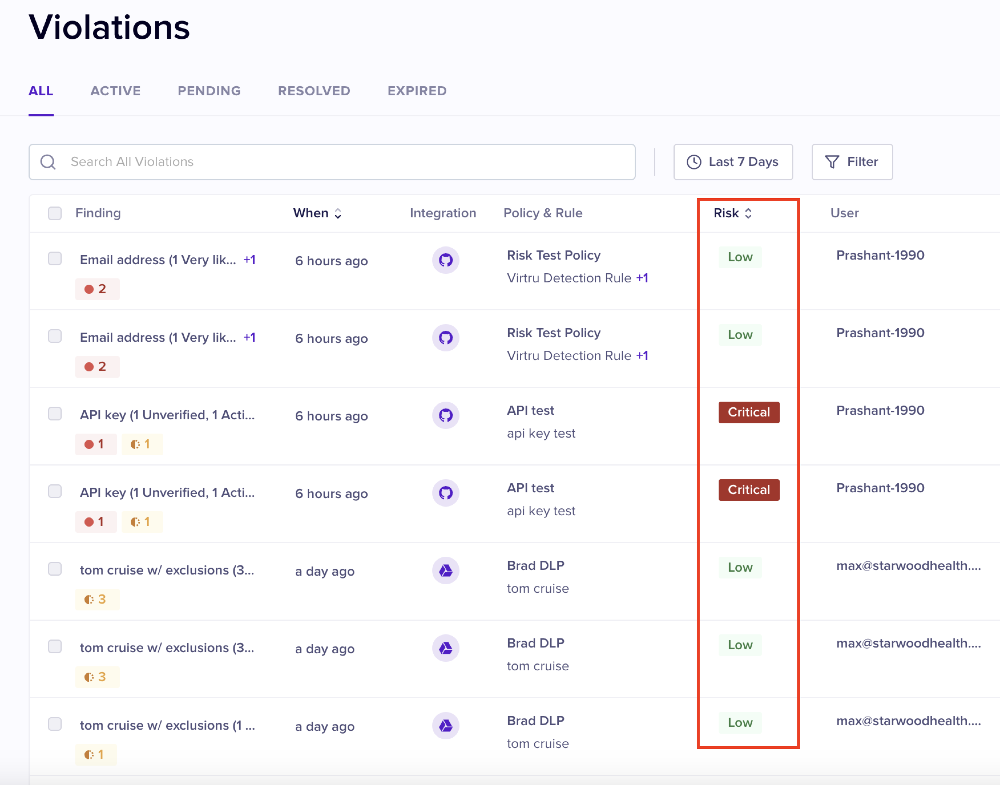
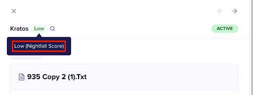

# Name and Risk Score

In this stage, you must provide a name to your policy. Additionally, you must also select the Risk scoring method for the policy.  &#x20;

## Naming the Policy

You must provide a name and optional description to the policy. Policy names must be unique across a single Nightfall tenant.&#x20;

<figure><figcaption></figcaption></figure>

## Risk Scoring

To help SecOps teams prioritise their efforts, we have introduced a risk-scoring system. The risk scoring system helps teams quickly identify and address the most critical issues.

This system scores violations based on various factors, such as the type and quantity of sensitive entities in a resource and the number of people with access to it.

### Risk Scoring

Nightfall assigns a risk score to each violation, reflecting its potential organisational damage. The score is determined based on several factors:

* **Info Type**: The sensitivity level of the specific information found affects the risk score.
* **Subtype:** The sensitivity level of the specific subtype of information, such as vendor-specific API keys and their status, adjusts the score. For example, an active cloud infrastructure API key has a higher risk than an active mail service API key, which in turn is riskier than an inactive API key.
* **Confidence**: The confidence level of each finding influences the risk score.
* **Count**: The number of instances of each info type found in a violation impacts the score.
* **Combination**: The combination of findings in a violation can increase risk. For instance, a combination of patient name, date of birth, and diagnosis constitutes a HIPAA violation.
* **Scope**: The number of people with access to the sensitive data affects the risk score. Data shared privately, internally, or publicly will have different risk levels.
* **Source**: The location of the violation, such as Slack messages, GitHub repositories, Google Drive documents, or ChatGPT prompts, also adjusts the risk score.
* **Document Type (Future):** In the future, document types will be considered in the risk score. Leaking sensitive documents like M\&A plans, executive compensation, product designs, formulas, and R\&D plans can pose an existential threat to the business.

The risk score can be one of the following.

* **Critical**: Violations with Critical risk score pose an existential threat to the business. For example, an active AWS key can give a bad actor immediate control of the company's infrastructure. A second example would be a resource containing ≥ 100 credit card numbers or PHI records.
* **High**: Violations with High risk score present a significant immediate legal and financial risk to the business or a strong indicator of future critical risks. For example, if a malicious actor gains access to your customer data through a database connection string, it can result in customer churn, lawsuits, and large governmental fines. The discovery of a credential demonstrates a standard of practice that will likely lead to active and critical risk. A second example would be a resource containing 10 to 100 credit card numbers and PHI records.
* **Medium**: Violations with medium risk score indicate poor data hygiene, which threatens the business when discovered in numbers or combination with other entities.&#x20;
* **Low**: Violations with low risk score indicate poor data hygiene. It may become a medium or high-risk issue when discovered with other entities. For instance, a VIN can uniquely identify a person (PII) and contribute to a protected healthcare information (PHI) finding.

### Risk Scoring for Custom Detectors

To accommodate users' custom detection needs, our risk scoring system for custom regex detectors assigns scores based on the number of findings detected within documents. The predefined risk score thresholds are:&#x20;

* low-risk for fewer than 10 findings,&#x20;
* medium-risk for 10 to 99 findings,&#x20;
* high-risk for 100 to 499 findings, and&#x20;
* critical-risk for over 500 findings.&#x20;

Users can override the automated score with a single, user-defined overall score, allowing for greater flexibility and control over the risk assessment process.

### Custom Risk Scoring

While creating a policy, you will notice that Nightfall's advanced scoring algorithm (known as **Nightfall Risk Score**) is selected by default. However, you can override this with a customized score tailored to your organization's needs (known as **Custom Risk Score**).

<figure><figcaption></figcaption></figure>

### Risk Scores for Historic Policies

The Risk Scoring feature is introduced in July/August 2024. All the policies created prior to this period, are automatically assigned the **Nightfall Risk Score** since it is the default option.&#x20;

### Documents with Multiple Findings of Varying Risk Scores

If a single document violates two different policies, each of which have a different level of risk score, the policy whose risk score has a higher level of precedence is assigned to the violation. For instance, consider that there are two policies called Policy A and Policy B. Policy A has a risk score **High** and Policy B has a risk score of **Medium**. If a single document violates both A and B policies, the risk score assigned to this violation is **High** since this score has the higher priority.&#x20;

### Viewing Risk Scores on Violations Page

The Violations page contains a column called **Risk**. This column displays the risk level for each violation.&#x20;

<figure><figcaption></figcaption></figure>

When you hover on a risk score, you can view if the risk score is calculated manually or assigned automatically by Nightfall. If a risk score is automatically assigned by Nightfall, the label shows **Nightfall Score**.

<figure><figcaption></figcaption></figure>

If a risk score is automatically assigned manually, the label shows **Custom** **Score**.

<figure><figcaption></figcaption></figure>

You can also click on the label from the content preview pane of a violation to automatically search for all violations matching that label and source.

<figure><figcaption></figcaption></figure>

You can sort the Violations based on this column. Sorting ensures that violations are sorted in either ascending or descending order of risk levels. Security teams can sort the violations in decreasing level of severity and start remediating them.&#x20;

<figure><figcaption></figcaption></figure>

Security teams can also search for risks with specific label (score) or source (custom or Nightfall).  The **risk\_label** operator allows you to search risks based on risk scores.&#x20;

<figure><figcaption></figcaption></figure>

The **risk\_source** operator allows you to filter Violations based on the source of the risk score.&#x20;
