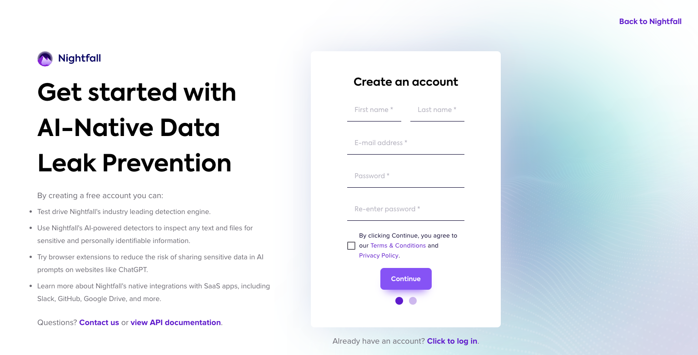
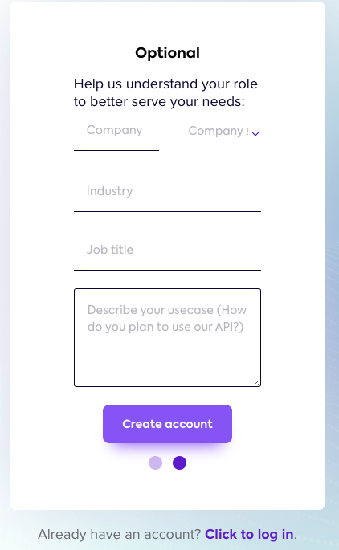
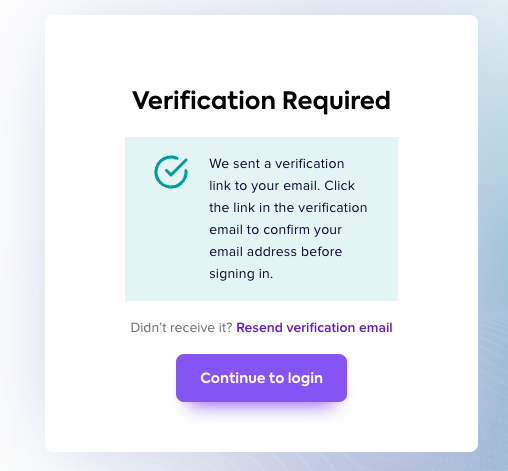

# Installing Nightfall

Nightfall is a SaaS-based cloud application. This document explains how you can sign up for a Nightfall account and start using the Nightfall application.&#x20;

To sign up for Nightfall:

1. Navigate to [app.nightfall.ai](https://app.nightfall.ai/).&#x20;
2. Click **Sign up**.

<figure><figcaption></figcaption></figure>

3. Provide the required details and click **Continue**.

<figure><figcaption></figcaption></figure>

4. (Optional) Enter the additional details.
5. Click **Create account**.

<figure><figcaption></figcaption></figure>

The following verification screen is displayed. Check your Email. You should have received a new Email from support@nightfall.ai. Click the verification link in the Email to verify your account. &#x20;

6. Click **Continue to login** to navigate to the login screen. You can log in to Nightfall only after verifing your Email.&#x20;

<figure><figcaption></figcaption></figure>

The blank Nightfall Dashboard page is displayed as follows.&#x20;

<figure><figcaption></figcaption></figure>

## Nightfall SaaS and Firewall for AI

The Nightfall SaaS app provides you with numerous integrations to connect to various third-party applications in which your data resides. You can connect to the integration in which your organization's data resides and then start scanning your data with Nightfall to detect sensitive information.&#x20;

By default, none of the integrations are active. You must contact Nightfall to subscribe to a paid plan and activate the required integration.

If an integration is not available for your desired application, you can subscribe to the Nightfall Firewall for AI. The Firewall for AI's APIs and SDKs help you integrate even those applications for which integration is not available in the Nightfall app.


**IMPORTANT**

Irrespective of whether you wish to use the Nightfall SaaS app or the Nightfall Firewall for AI, you must have a fair understanding of the [Nightfall Detection Engine](https://help.nightfall.ai/nightfall-exfiltration/exfiltration_detection_engine/nightfall-detection-engine) (Detectors, Detection rules, and Policies).&#x20;


