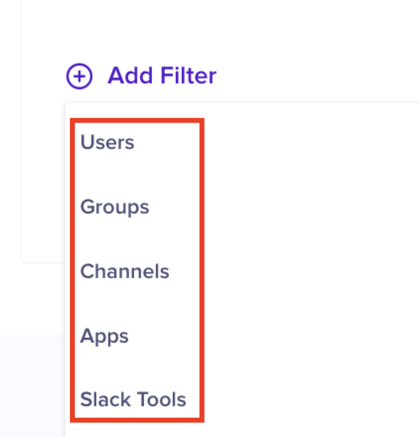

# Create Content Compliance Rule - Monitoring


This document is only applicable to new customers who are setting up Gmail DLP for the first time. If you are an existing customer and have setup Gmail DLP previously, refer [this documentation](https://help.nightfall.ai/gmail/installation/content_compliance_rules/monitroring-1).


The first content compliance rule is used to monitor all outgoing emails.&#x20;


**Important**

It is mandatory for you to create this rule to monitor outgoing emails for sensitive data.&#x20;


## Prerequisites

In the Nightfall UI, navigate to **Integrations** from the left navigation bar and click the **Manage** button for the Gmail integration.&#x20;

<figure><figcaption></figcaption></figure>

All the headers and expressions required to create the compliance rules are available in the **Installation** section under Gmail settings as displayed in the image below. Keep this screen open to copy/paste the headers as you create the content compliance rules in Google Workspace. We will refer to this page as the **Gmail settings** page throughout the document.&#x20;

<figure><figcaption></figcaption></figure>

## Content Compliance Rule

The steps to create content compliance rule are as follows.&#x20;

1. Log in to your Google Workspace with an admin account.
2. Navigate to the admin console.&#x20;
3. From the left menu, expand **Apps** > **Google Workspace > Gmail.**
4. Scroll down and click **Hosts**.
5. Click **ADD ROUTE**.

<figure><figcaption></figcaption></figure>

6. Enter a name for the mail route.&#x20;
7. Type the following host name.

```http
2r2xfv8u7uz5.fips.qbns.mail-manager-smtp.amazonaws.com
```

8. Enter **25** as the port number.&#x20;
9. Click **SAVE**.

<figure><figcaption></figcaption></figure>

10. Scroll down and click **Compliance**.

<figure><figcaption></figcaption></figure>


When you click **Compliance**, you can view the list of Organization Units (OUs) on the left of the screen (see image below). You can directly configure the compliance rules and routing rules on your production OU (OU at the top most level) by selecting the same.&#x20;

However, Nightfall recommends that you initially configure the rules on a subset OU (one of the nested OUs) which has a small set of users. When you click on a nested OU, the rules are created only for the nested OU that you select. Once you verify that the configuration is working as expected on the nested OU, you can configure the compliance rules on the production OU.&#x20;


<figure><figcaption></figcaption></figure>

5. Scroll down to the **Content Compliance** section and click **ADD ANOTHER RULE**. (If you have not created any Compliance rule previously, the button might be displayed as **CONFIGURE**).

<figure><figcaption></figcaption></figure>

### **Step 1 - Email Messages to Affect**

1. Enter a name for the compliance rule. For example, Nightfall DLP.
2. Select **Outbound** and **Internal - Sending** checkboxes in the **Email messages to affect** section.

<figure><figcaption></figcaption></figure>


If you select only the **Outbound** check box, only those emails that are routed out of your organization to external domains, are scanned. If you wish to scan internal emails (emails that are sent between the employees of your organization), you must select the **Internal - Sending** check box.


### Step 2 - Add Expressions

1. In step 2 of the content compliance rule, select the **If ALL of the following match the message** option.
2. You need to **add two expressions in step 2 of content compliance rule.** Click **ADD**.

<figure><figcaption></figcaption></figure>

3. In the **Add** **setting** dialog box, select the **Advanced Content** match option.
4. In the **Location** drop-down menu, select **Sender header.**
5. In the **Match** **type** drop-down menu select **Matches Regex.**
6. Navigate to the **Gmail settings** page on the Nightfall UI, refer to the regular expression format defined under the **Monitoring Content Compliance Rule** section, and create a regular expression that matches your organization name.


For example, if your organization name is Contoso.com, you can create the regular expression as `.*@contoso\.com$`

If you are using multiple domains to send emails from your organization and you need to scan outgoing emails from all those domains for sensitive data, you can use a regular expression to specify multiple domains as illustrated in installation instructions in the Nightfall console. For example, `(.`_`@domain-name.extension$|.`_`@domain-name.extension$)`


7. In the **Regexp** field, enter the regular expression to match your organization name.
8. Click **SAVE**.

<figure><figcaption></figcaption></figure>

9. You can now add a second expression in step 2 of the content compliance rul&#x65;**.** Click **Add**.
10. Select **Advanced content match** in the drop-down menu.
11. In the **Location** drop-down menu, select **Full headers**.
12. &#x20;In the **Match** **type** drop-down menu select **Not Contains text.**
13. Navigate to the **Gmail settings** page on the Nightfall UI and copy the value from the **Header** field, located under the **Full Header** section.&#x20;
14. Return to the Google Admin Workspace window and paste the copied value in the **Content** field.
15. Click **SAVE**.

<figure><figcaption></figcaption></figure>

The condition expression is created as follows. This expression ensures that all the emails that are not yet scanned by Nightfall are scanned.

<figure><figcaption></figcaption></figure>

### Step 3 - Modify Message and Add Custom Headers

1. In step 3, select **Modify message**.
2. Under the **Headers** section, select the **Add X-Gm-Original-To header** check box.
3. &#x20;Select the **Add custom headers** check box. The **Custom headers** section is displayed once you select this check box.
4. Click **ADD** under **Custom headers** to add a new custom header.

<figure><figcaption></figcaption></figure>

There are two fields; **Header key** and **Header value**.

<figure><figcaption></figcaption></figure>

5. Navigate to the **Gmail settings** page on the Nightfall UI and copy the value from the **Authentication** field, located under the **Messaging Modification** section.
6. Return to the Google Admin Workspace window and paste the copied value in the **Header key** fiel&#x64;**.**&#x20;
7. Navigate to the **Gmail settings** page on the Nightfall UI and copy the value from the **Nightfall UUID** field, located under the **Messaging Modification** section.
8. Return to the Google Admin Workspace window and paste the copied value in the **Header value** field.&#x20;
9. Click **SAVE**.

<figure><figcaption></figcaption></figure>

10. Scroll down to the **Route** section and select the **Change Route** check box.&#x20;
11. From the dropdown menu, select the routing rule created in the [#content-compliance-rule](monitroring.md#content-compliance-rule "mention") section (step 5).&#x20;

<figure><figcaption></figcaption></figure>

12. Scroll down to the **Encryption (onward delivery only)** section and select the **Require secure transport (TLS)** check box.&#x20;
13. Click **SAVE**.

<figure><figcaption></figcaption></figure>


