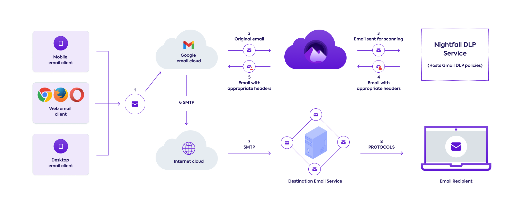

# Overview

Nightfall DLP for Gmail allows you to scan all outgoing emails for sensitive data. If sensitive data is found, Nightfall allows you to set automated actions to block, quarantine or automatically encrypt outgoing emails.&#x20;

The inline workflow of Nightfall DLP for Gmail is depicted in the following image.

<figure><figcaption></figcaption></figure>

* The end-user uses either a Web email client, a Desktop email client, or a Mobile client to draft and send the email from your domain.
* The Email sent via Google email server is routed to Nightfall.&#x20;
* Nightfall scans the email as per the defined policies defined and adds headers to the emails.&#x20;
* Nightfall then relays the emails with updated headers back to Google email server from where they are sent to intended recipients on behalf of the organization's domain.&#x20;
* If the policy is configured with automated actions such as block, quarantine, or automatic encryption as an example, these actions are enforced by the Google email server accordingly.

\
