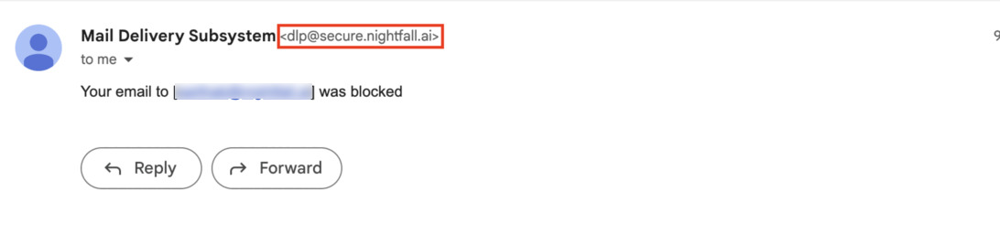
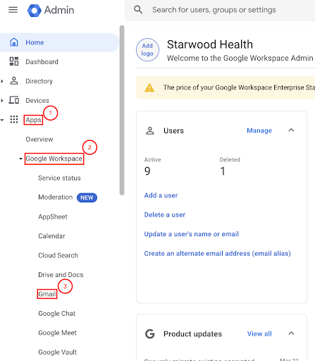
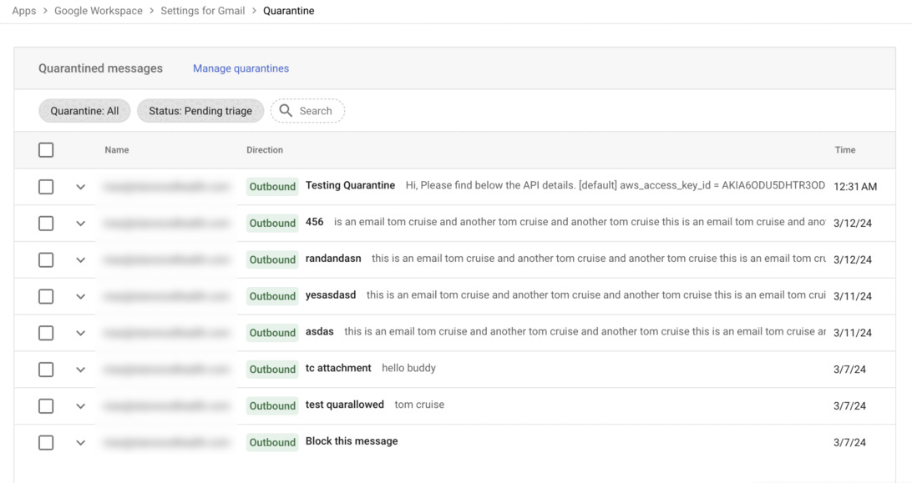

# Remediation on Nightfall for Gmail

This document explains the impact on end-users and Google Workspace admins when the automated actions in Gmail DLP (Block and Quarantine) are implemented.&#x20;

To learn more about configuring automated actions for Gmail DLP, see, [Automated actions](policies/advanced_settings.md#automated-actions).

## Block

When an Email is blocked, the end user receives an Email from Nightfall that informs them that their Email was blocked. End users receive this email from <mark style="color:blue;">dlp@nightfall.ai</mark>. Apart from this email, end users also get the original Email which was blocked.

The Email looks as follows.&#x20;

<figure><figcaption></figcaption></figure>

The status of the Violation is also automatically changed to Blocked when the Email is blocked.

## Quarantine

When an email is quarantined, it is stored separately in a secure Gmail server. A Google Workspace admin must visit the server, review the quarantined email, and decide as to whether the email must be allowed to travel to the recipient or be blocked.&#x20;

To access the quarantine emails:

1. Login to your Google Workspace with an admin account.
2. Click the menu icon.
3. Select **Admin**.

<figure><figcaption></figcaption></figure>

4. In the left menu, expand **Apps** and then expand **Google Workspace**.
5. Click **Gmail**.

<figure><figcaption></figcaption></figure>

6. Scroll down and click **Manage quarantines**.

<figure><figcaption></figcaption></figure>

7. Click **GO TO ADMIN QUARANTINE**.

<figure><figcaption></figcaption></figure>

The list of all the quarantined emails is displayed.&#x20;

<figure><figcaption></figcaption></figure>

Click any email to expand it. You can view three options.&#x20;

* **SHOW ORIGINAL** - This option displays the full email.
* **ALLOW** - This option releases the email from quarantine and sends it to the recipient. You must select this option if you are confident that the sensitive data detected by Nightfall is false positive.
* **DENY** - This option blocks the email and does not send it to the recipient. You must select this option if you are confident that the sensitive data detected by Nightfall is actually sensitive.

<figure><figcaption></figcaption></figure>
