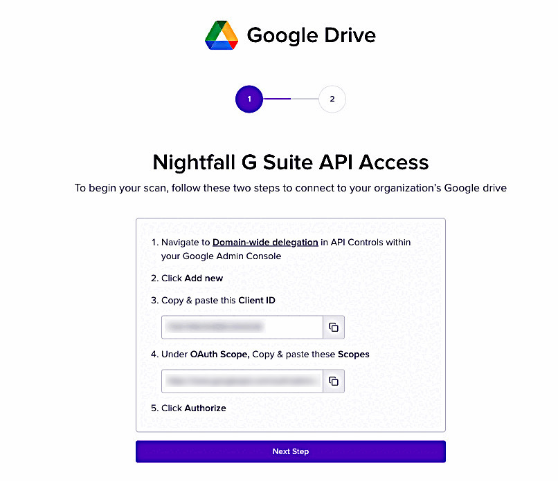
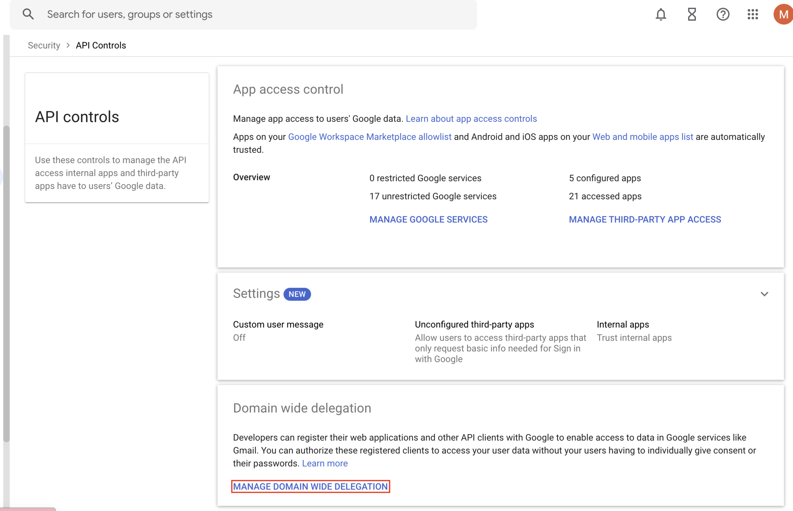

# Install Nightfall for Google Drive

This document explains the steps to install the Nightfall DLP for Google Drive. Nightfall recommends that you read the [requirements.md](requirements.md "mention") document for Google drive installation and then proceed with this document.

To install Nightfall for Google Drive:

1. Log in to Nightfall.
2. Click **Integrations** from the left menu.
3. Click **Manage** on the Google Drive integration.&#x20;

<figure><figcaption></figcaption></figure>

4. Click **Begin Setup**. 

The access permission page is displayed as follows. Copy the **client ID** and **OAuth Scope** generated. Store these values securely. You will require them to configure [Google Drive Labels](https://help.nightfall.ai/google-drive/getting_started/labels#adding-scope-of-google-drive-labels-api) (step 5).

<figure><figcaption></figcaption></figure>

5. In a new browser tab, login to your Google Workspace with an admin account.
6. Click the menu icon.
7. Select **Admin**.

<figure><figcaption></figcaption></figure>

8. In the Admin console left pane, expand **Security** and then expand **Access and data control**.
9. Click **API controls**.

<figure><figcaption></figcaption></figure>

9. Click **MANAGE DOMAIN WIDE DELEGATION** under **Domain wide delegation**.

<figure><figcaption></figcaption></figure>

10. Click **Add New**.

<figure><figcaption></figcaption></figure>

11. Paste the **Client ID** copied from the Nightfall app, in the **Client ID** field.
12. Paste the **Scopes ID** copied from the Nightfall app, under **OAuth Scope** fiel&#x64;**.** Use comma to add multiple scope IDs.&#x20;
13. Click **AUTHORIZE.**&#x20;

<figure><figcaption></figcaption></figure>

14. Return to the Nightfall app and click **Next Step**.

<figure><figcaption></figcaption></figure>

15. Click **Connect**.

<figure><figcaption></figcaption></figure>


**Note**

Once the installation is complete, Nightfall needs to sync data from your Google Drive. This process takes a few minutes. You can create policies before the sync process is completed. However, the process of scanning files begins once the sync is completed.&#x20;



Once the installation and sync is completed, Nightfall connects to your Google Workspace account and fetches all the domains. In the above image, you can see that 3 domains are fetched. These three domains were already present in your Google Workspace and are internal to your organization. Nightfall also allows you to add external domains as internal domains. You can do this by clicking the ellipsis menu at the right end and selecting **Manage Domains**.


<figure><figcaption></figcaption></figure>

The **Manage Domains** window is displayed as follows.

<figure><figcaption></figcaption></figure>

Enter the domain name in the **Domain Name** field, hit the enter key, and click **Confirm**.
