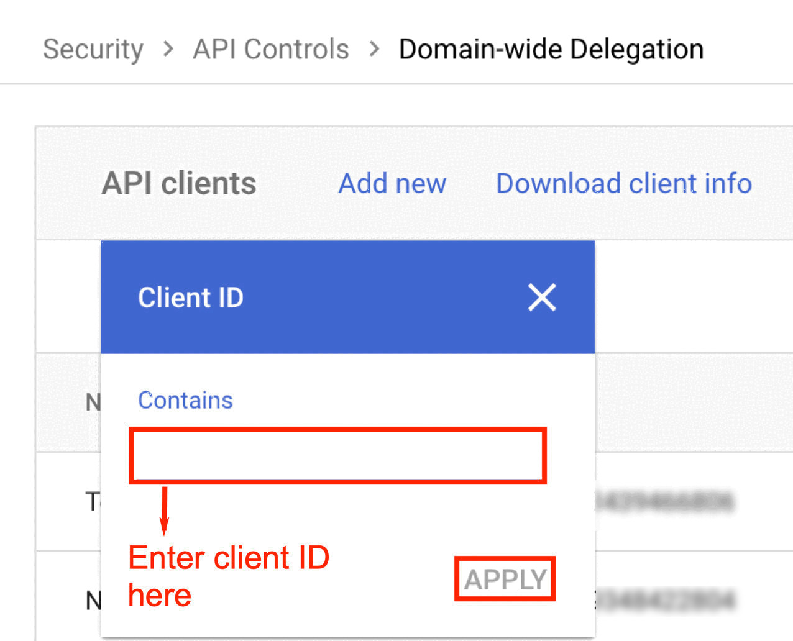
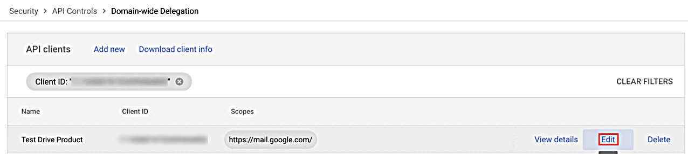

# Enable Google Drive Labels

Labels in Google Drive support various business operations by adding additional metadata to files. Nightfall leverages Google Drive labels to identify sensitive data in Google Drive files and apply automated actions based on labels. To learn more about Google Drive labels, refer to this [Google document](https://support.google.com/a/answer/9292382?hl=en\&ref_topic=13128179\&fl=1\&sjid=13080326729164278818-NC).

To enable Google Drive labels, you must perform the following prerequisite actions.&#x20;

[#adding-scope-of-google-drive-labels-api](labels.md#adding-scope-of-google-drive-labels-api "mention")

[#enabling-google-drive-labels-api](labels.md#enabling-google-drive-labels-api "mention")

## Adding Scope of Google Drive Labels API

To use Google Drive labels, Nightfall admins must perform the following configurations in your Google Workspace account. You must have the client ID of your Google Workspace.&#x20;

1. Log in to Google Workspace as an admin.
2. Navigate to [Domain wide delegations](https://admin.google.com/ac/owl/domainwidedelegation).
3. Click **Add a filter**.

<figure><figcaption></figcaption></figure>

4. Select **Client ID**.&#x20;

<figure><figcaption></figcaption></figure>

5. Enter the client ID and click **Apply**.&#x20;


You can use the Client ID stored during the installation of Nightfall for Google Drive integration. The details can be found in this [Nightfall documentation](installation.md) (step 4).


<figure><figcaption></figcaption></figure>

The matching account is displayed.&#x20;

6. Hover your mouse to the right and click **Edit**.

<figure><figcaption></figcaption></figure>

7. In the **OAuth scopes** field, enter the following scope and click **Authorize**.

```http
https://www.googleapis.com/auth/drive.admin.labels
```

### Enabling Google Drive Labels API

Once the scope is added, Nightfall admins must enable the Google Drive Label API. Nightfall recommends you to read this [Google documentation](https://developers.google.com/workspace/guides/enable-apis) on enabling APIs before proceeding with this section.&#x20;

1. Navigate to the Google Drive Labels API from the GCP console that can be found [here](https://console.cloud.google.com/apis/library/drivelabels.googleapis.com).&#x20;
2. Click the **Select a Project** menu.

<figure><figcaption></figcaption></figure>

The list of Google projects is displayed.&#x20;

3. Select a Project that has the Service Account, used to install the Nightfall Google Drive integration

<figure><figcaption></figcaption></figure>

3. Click **Enable**.

<figure><figcaption></figcaption></figure>


**Important**

Before using Google Drive Labels in Google Drive policies, ensure that you have created the appropriate Google Drive Labels. To learn more about creating Google Drive labels, refer this [Google Document](https://support.google.com/a/answer/13127870?hl=en).&#x20;



