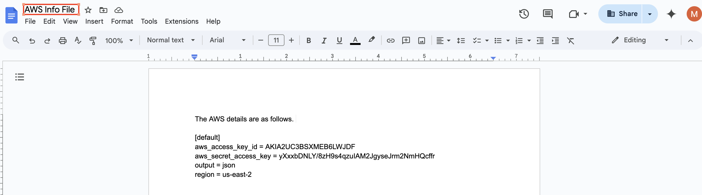

# Manage Google Drive Events

Nightfall admins and end-users can view Google Drive Events in three ways. This document explains the three methods.&#x20;

## Admin Notification and Remediation

When end-users violate a policy, the Nightfall admin is notified about the incident. The notification channel used to notify the Nightfall admin depends on the settings configured in the [Admin Alerting](https://help.nightfall.ai/nightfall-exfiltration/exfiltration_nightfall_google_drive/configuring-google-drive-policies/automated-actions#admin-alerting) section. If you have not enabled any notification channels in the Admin alerting section, Nightfall admins are not notified.

If you have enabled the email notification in the Admin alerts section, Nightfall admins receive an email. The email is as shown in the following image.

<figure><figcaption></figcaption></figure>

At the end of the email, action list is displayed. Nightfall admins can take the action as required.&#x20;

<figure><figcaption></figcaption></figure>

If Slack notifications is enabled, Nightfall admins also receive a message in the respective Slack channel. &#x20;

<figure><figcaption></figcaption></figure>

Just as in case of Email, at the end of the Slack message, possible actions are displayed.&#x20;

<figure><figcaption></figcaption></figure>

## End-User Notification and Remediation

When an end user violates a policy in Google Drive, a notification is generated based on the notification settings configured by Nightfall admins in the policy configurations. If end-user notifications is configured in the [#end-user-notification](advanced_settings.md#end-user-notification "mention") section, end-users receive an email as shown in the following image.

<figure><figcaption></figcaption></figure>

Apart from end-users notifications, if Nightfall admins also enable remediation actions in the [#end-user-remediation](advanced_settings.md#end-user-remediation "mention") section, end-users can take appropriate actions. The available list of actions depend upon the settings configured in the [#end-user-remediation](advanced_settings.md#end-user-remediation "mention") section.&#x20;

<figure><figcaption></figcaption></figure>

## Nightfall Events

Nightfall admins can view and take actions on the Google drive Events from the [Nightfall Events](https://help.nightfall.ai/sensitive-data-protection/dashboards_violations/nightfall-events) console.

1. Click **Detection and Response** from the left pane.
2. Select Filter and filter by Integration to view only the Google Drive Events.

<figure><figcaption></figcaption></figure>

3. (Optional) To view Events prior to the **Last 7 days**, click on the date filter and choose the appropriate date range or enter a custom date range.

<figure><figcaption></figcaption></figure>

Once you filter the Events to view only the Google Drive events, you can refer to the [#event-list-view](../../dashboard/sdp_events/#event-list-view "mention") section to learn more about the available options.&#x20;

4. Click on any of the Events to view details of an Event. You may click anywhere in the row of an Event that you wish to inspect. Details will be present via a side panel.

<figure><figcaption></figcaption></figure>


You can reduce the noise from known files repeatedly generating new violations by ignoring all violations in a specific file, keeping you focused on new, unknown risks. All current Violations and future violations generated by this file are automatically ignored.&#x20;

You can also Undo the Ignore all action.

When you apply the Ignore all action:

* All existing violations from the selected item are automatically marked as "Ignored" and moved to the Resolved tab.
* An activity is created in the log entry to reflect the automated action on any violation that is automatically ignored.
* Ignored automatically - "Auto-ignore is enabled for all future violations from this item.


<figure><figcaption></figcaption></figure>

The side panel is divided into three separate sections. The first section has information about the occurrence of individual findings with a preview. The third section is an activity log for the Event. Both these sections reveal information that is common across all sources/integrations. You can refer to these common sections in the [#event-detail-view](../../dashboard/sdp_events/#event-detail-view "mention") section.

The second section displays details that are source / integration specific and so the details vary from one integration to the other.&#x20;

The side panel is divided into three separate sections. The first section has information about the occurrence of individual findings with a preview. The third section is an activity log for the Event. Both these sections reveal information that is common across all sources/integrations. You can refer to these common sections in the [#event-detail-view](../../dashboard/sdp_events/#event-detail-view "mention") section.

The second section displays details that are source / integration specific and so the details vary from one integration to the other.&#x20;

## Event Actions

Nightfall allows you to take various action on Events. When you take an action on an Event, the status of the Event changes accordingly. To learn more about Event status, refer to the [status.md](../../dashboard/sdp_events/status.md "mention") document.

In Google Drive, you can take actions either from the Event list view page or the Event detail view page. On the Event list view page, you can click the ellipsis menu to view the available list of actions.&#x20;

<figure><figcaption></figcaption></figure>

On the Event detail view, you can view the applicable actions from the actions section at the bottom.

<figure><figcaption></figcaption></figure>

To view the complete list of actions, applicable to all the integrations, you can refer to the [event\_actions.md](../../dashboard/sdp_events/event_actions.md "mention") document.&#x20;

The list of actions supported for Google Drive are as follows. Some of these actions are common to other integrations as well.&#x20;

* **Copy Event Link**: The action copies the link to the Event. You can save or send this link to directly open the Event. This action is available only on the Event detail view.
* **View in Google Drive**: This action redirects to the relevant document with sensitive data in the source Google Drive. While this action is available only on the Event detail view, please note that relevant access to the document in source Google Drive should be present.
* **Download Original Content**: This action downloads the original file that contains sensitive data. If the file is deleted or moved to a different location within Google Drive, this action fails. This action is available only on the Event detail view.
* **Ignore**: The ignore action flags Nightfall to ignore all the findings in the Event and may be taken if you find the findings false positive. This action marks the Event as resolved and moves it to the Resolved section. You can undo this action.&#x20;
* **Acknowledge**:  You can take this action to notify other users that you have looked into this Event and will take suitable action in future.&#x20;
* **Notify Slack**: This action notifies the end user who added the sensitive data file to the Google Drive about the event,  through Slack.
* **Notify Email**: This action notifies the end user who added the sensitive data file to the Google Drive about the event,  through email.
* **Send to JIRA**: This action creates a JIRA ticket for the Event. You can pick a project and Issue type while creating the JIRA ticket and can assign the JIRA ticket to the end-user
* **Change Link Settings**: This action allows you to modify the sharing settings of the file thus restricting the access of the file to a few users.
* **Disable Download**: This action disables users from downloading the file.
* **Apply Labels**: This action allows you to apply labels on the file. Refer to the [#applying-labels](events.md#applying-labels "mention") section for details.
* **Resolve**: This action must be taken when the sensitive data is removed completely from the source file. This action resolves the Event.&#x20;


To learn more about how Nightfall handles Deduplication and Auto Resolution of Google Drive Events, view [#google-drive](../../dashboard/sdp_events/deduplication.md#google-drive "mention").


## Applying Labels

When you apply labels to a Google Drive file either through automated actions or manually (by a Nightfall admin or end-user), the applied label is displayed next to the title of the file.&#x20;

In the following image, you can view a Google doc on which label is not applied.&#x20;

<figure><figcaption></figcaption></figure>

The following image displays the same file, once a badge label is added.

<figure><figcaption></figcaption></figure>

If you add a new badge label, it replaces the previously applied badge label.&#x20;
