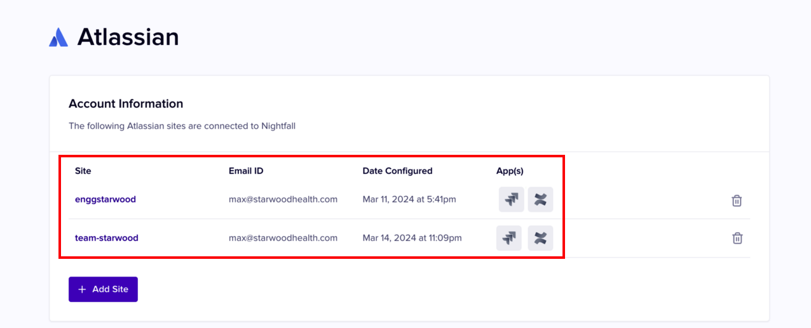
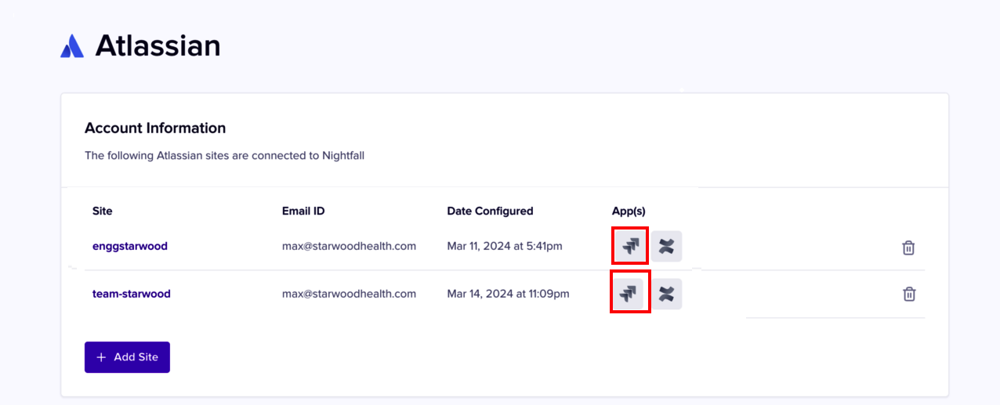

# Install Nightfall for Jira

This document explains the process of installing Nightfall for Jira.&#x20;

## Prerequisites

The installation of Jira integration requires you to have the following prerequisites

* An Atlassian tenant with Jira enabled.&#x20;
* You must have access and must be logged in to the Atlassian account.&#x20;

## Installation Method

Jira and Confluence are both products of Atlassian. Hence, the installation procedure for **Nightfall for JIRA** and **Nightfall for Confluence** is similar with a few minor changes. You must first log in to your Atlassian account on which you wish to install the Nightfall for Jira integration. This login must be done on the same browser from which you are accessing the Nightfall application. Nightfall automatically lists all the Atlassian accounts to which you are logged in. You must authorize Nightfall to your Atlassian account on which you wish to install Nightfall for Jira. Once the authorization is completed, you must install the **DLP for Jira** application from the [Atlassian marketplace](https://marketplace.atlassian.com/apps/1226823/dlp-for-jira-nightfall-ai?hosting=cloud\&tab=overview).&#x20;

## Installation Steps

1. Log in to your Atlassian tenant on which you wish to install the Nightfall for JIRA integration.
2. Log in to the Nightfall application, in a new tab, from the same browser, used to log in to Atlassian.&#x20;
3. Click **Integrations** under the **Configuration** section.
4. Click **Manage** for the **Jira** integration.

<figure><figcaption></figcaption></figure>


If you have not yet subscribed to the Jira integration, the **Manage** button is replaced by **Contact Sales** button. Click **Contact Sales** to sync up with the Nightfall sales team to discuss how you can subscribe to the Jira integration.


You can see that Nightfall lists the Atlassian accounts to which you have logged in. In the following image, there are two Atlassian accounts.&#x20;

4. Click **+ Add Site** to authorize the Atlassian account.&#x20;

<figure><figcaption></figcaption></figure>


If you do not have Confluence or Jira set up on your Atlassian account, you cannot see the respective icons under the **App(s)** column.  &#x20;


You are navigated to the Atlassian site.&#x20;

<figure><figcaption></figcaption></figure>

5. Under the **Use app on** drop-down menu, choose the Atlassian site that you wish to authorize and install the **DLP for Jira** app. &#x20;


If you have a single Atlassian account, Nightfall automatically selects the Atlassian account for authorization. This drop-down menu is active only when you have multiple Atlassian accounts.&#x20;


<figure><figcaption></figcaption></figure>

6. Click **Accept**.&#x20;

<figure><figcaption></figcaption></figure>

7. Click the Jira icon for the Atlassian account that you authorized in the previous step.&#x20;

<figure><figcaption></figcaption></figure>

You are navigated to the Atlassian Marketplace where the **DLP for Jira** app is located.

8. Click **Get it now**.

<figure><figcaption></figcaption></figure>

9. Choose the Atlassian account that you authorized in step 4 under the **Select a site to install this app** drop-down menu.

<figure><figcaption></figcaption></figure>

Nightfall displays the list of Jira products on which the app will be installed. This list is based on the Jira products present in your Atlassian account.&#x20;

10. Click **Install app**.

<figure><figcaption></figcaption></figure>

11. Click **Get it now**.&#x20;

<figure><figcaption></figcaption></figure>

Once the installation is completed, you can view a pop-up box at the left bottom of your screen. You can click **Manage app** to customize the settings.&#x20;

<figure><figcaption></figcaption></figure>

When you return to the Nightfall application, the appearance of the JIRA icon changes once the **DLP for Jira** app is installed. This confirms the successful installation of the **DLP for Jira** app.&#x20;

<figure><figcaption></figcaption></figure>


**Important**

Once you install the DLP for Jira application on an Atlassian account, Nightfall automatically configures the Alert platform with this Jira account. You can confirm this by navigating to **Settings** -> **Alert platforms** in Nightfall.


<figure><figcaption></figcaption></figure>

In the Atlassian integration page, there is a phrase attached to this Atlassian account known as **Alert Destination** which also confirms that this Jira is used as an Alert platform.

<figure><figcaption></figcaption></figure>

When you install **DLP for Jira** on another Atlassian account, the alert destination automatically shifts to the new Atlassian account on which the DLP for Jira is recently installed.
