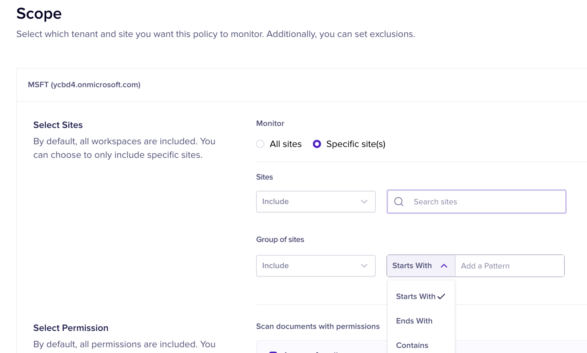

# Configure Scope for SharePoint

The Scope section allows you to select specific sections of SharePoint to be monitored. Once you select the Sites or group of sites to be monitored, you can further add granular level filters to exclude the monitoring of specific libraries, file extensions, and folder paths within the selected site(s).&#x20;

**Note**: If you have configured multiple Microsoft tenants in Nightfall, you must first select the tenant to be monitored.&#x20;

Nightfall provides the following sections on the Scope page.&#x20;

## Select Sites

In this section, you must select the sites to be monitored. You can either choose to monitor all the sites or only specific sites or group of sites. The sections available are as follows.&#x20;

* **All Sites**: You must select this section to monitor all the sites in your SharePoint account.&#x20;
* **Specific Site(s)**: You must select this section to monitor specific sites in your SharePoint account. This section provides the following options.
  * &#x20;**Sites**: Use the drop-down menu to select the sites to be monitored.&#x20;
  * **Group of Sites**: Use the drop-down menu to select a group of sites whose names **start with**, **end with**, or **contain** a specific pattern.&#x20;

<figure><figcaption></figcaption></figure>

## Select Permission

Once you select the required sites, you must select the files with specific permissions to be monitored. The available file permission options are as follows.&#x20;

* Access with owners Only
* Access within Organization
* Access outside of organization
* Access via public link

## Filters

Nightfall provides the following filters which you can use to exclude files from within the selected site and with selected permissions. You can use the filters with the Starts with, ends with, or Contains clauses.

* Library
* File Extension
* Folder Path

