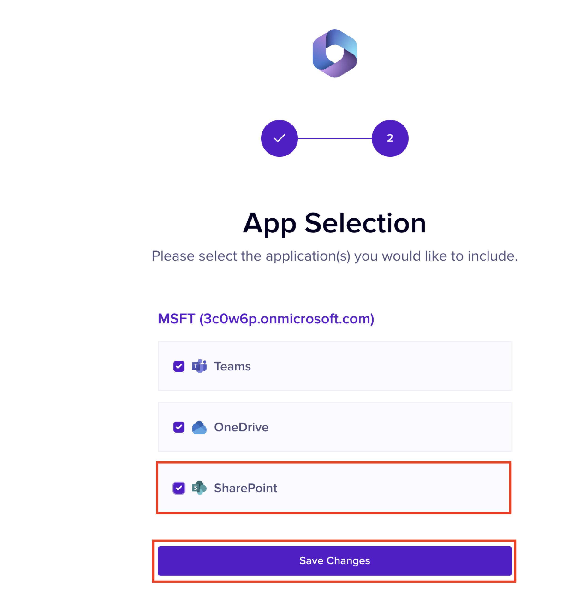

# Installing Microsoft SharePoint

This document explains the process of installing SharePoint.&#x20;

## Installation

1. Click **Integrations** from the left menu.
2. Click **Manage** under the **SharePoint** widget.
3. Click **+ Add Tenant.**&#x20;

You are redirected to the Microsoft login page.&#x20;

4. Log in to your Microsoft account.&#x20;

The App Selection page is displayed.

5. Ensure that the **SharePoint** check box is selected.
6. Click **Save Changes**.&#x20;

<figure><figcaption></figcaption></figure>
