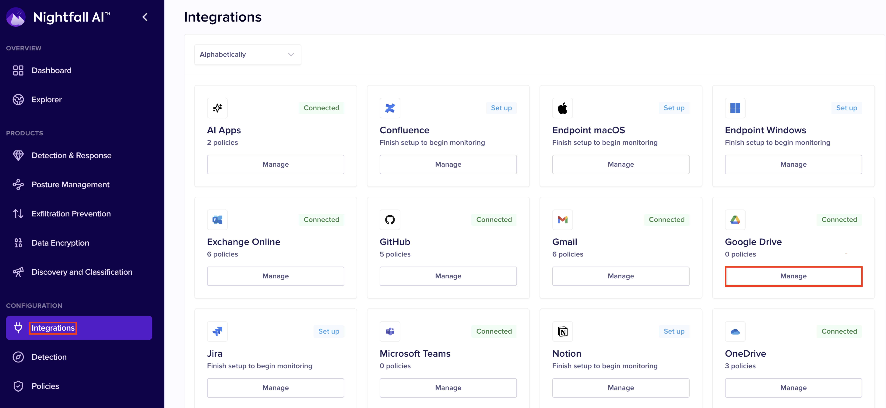

# Create Rules

The Email flow rule enables Nightfall to route your emails back to Exchange Online once scanned.&#x20;

Additionally, you can also create a rule for quarantining suspicious emails. This rule is optional and is required only if you wish to quarantine emails.&#x20;

1. On the **Exchange Admin Center** page, Expand **Mail flow** and select **Rules**.
2. Click **Add a Rule** and select **Create a new Rule**.&#x20;
3. Enter a name for the rule in the **Name** field.&#x20;
4. In the **Apply this rule if** field, select **The sender**.
5. Select **Is External/Internal**.
6. Select **Inside the Organization** in the **select sender location** field.
7. Click **Save**.&#x20;
8. Select **Redirect the message to** in the **Do the following** field.&#x20;
9. Select the **Following connector** option and select the connector created in the **OutBound Connector** section. &#x20;
10. &#x20;Click **Save**. &#x20;
11. Click **+** to add an additional condition to the rule.&#x20;
12. Select **Modify the message properties** in the **And** field.
13. Select **Set a message Header.**
14. Click the first **Enter text** button.

<figure><figcaption></figcaption></figure>

15. Enter **x-nightfall-id** and click **Save**.&#x20;
16. Click the second **Enter text** button.
17. Enter the UUID of your Nightfall tenant and click **Save**. You can view the UUID of your Nightfall tenant by navigating to the **Settings** section from the Nightfall app.
18. Select **The message headers…** in the **Except if** field.&#x20;
19. Select **includes any of these words.**&#x20;
20. Click **Enter text**.&#x20;
21. Type **x-nightfall-scanned** and click **Save**.&#x20;
22. Click **Enter words**.&#x20;
23. Type **True**, and click **Add**. Select the **True** check box.&#x20;
24. Click **Save**.

<figure><figcaption></figcaption></figure>

25. Click **Next**.&#x20;
26. Ensure that the **Rule mode** is set to **Enforce** and the **Severity** is set to **High**.
27. Click **Next**.&#x20;
28. Click **Finish**.

## Create Quarantine Rule

You must create this rule only if you wish to implement the quarantine action while creating policies.

1. Click **Add a Rule** and select **Create a new Rule**.&#x20;
2. Enter a name for the rule in the **Name** field.
3. In the **Apply this rule if** field, select **The message headers...**
4. Select **includes any of these words.**

<figure><figcaption></figcaption></figure>

5. Click **Enter Text**.&#x20;
6. Type **X-NIGHTFALL-QUARANTINE** and click **Save**.&#x20;
7. Click **Enter words**.&#x20;
8. Type **True**, and click **Add**.&#x20;
9. Select the **True** option.&#x20;
10. Click **Save**.

<figure><figcaption></figcaption></figure>

11. Select **Redirect the message** to in the **Do the following** field.&#x20;
12. Select the **hosted quarantine** option. &#x20;
13. Select **The message headers** option in the **Except if** field.&#x20;
14. Select **includes any of these words.**
15. Click **Enter Text**.&#x20;
16. Type **X-MS-Exchange-Generated-Message-Source** and click **Save**.&#x20;
17. Click **Enter words**.&#x20;
18. Type **Quarantine**, and click **Add**.&#x20;
19. Select the **Quarantine** option.&#x20;
20. Click **Save**.&#x20;
21. Click **Next**.&#x20;

<figure><figcaption></figcaption></figure>

12. Ensure that the **Rule mode** is set to **Enforce** and the **Severity** is set to **High**.
13. Click **Next**.&#x20;
14. Click **Finish**.
