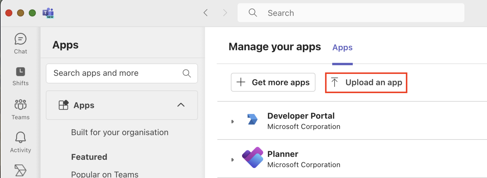

# Setting up MS Teams as an Alert Platform

This document explains the process of using MS Teams as an alert platform in the Nightfall application.&#x20;


Currently, you can use MS Teams as an alert platform only in the Microsoft OneDrive for Business and MS Teams integrations.


## Prerequisites

* Contact your Nightfall CSM to obtain the package file required during the setup.
* You must have credentials to an MS Teams admin account.

## Installation

1. Open the MS Teams app.
2. Click the **Apps** menu from the left sidebar

<figure><figcaption></figcaption></figure>

3. Click **Manage your apps**.

<figure><figcaption></figcaption></figure>

4. Click the **Upload an app** option.&#x20;

<figure><figcaption></figcaption></figure>

5. Select the **Upload an app to your organisation’s app catalogue** option.

<figure><figcaption></figcaption></figure>

6. Upload the Nightfall package obtained from your Nightfall CSM. The Nightfall Alerts app is available in your organisation’s Teams app catalogue once you upload the package.
7. Search the term _Nightfall_ in the Teams search bar. You must now be able to see the **Nightfall Alerts** app.&#x20;

<figure><figcaption></figcaption></figure>

8. Click **Add** for the **Nightfall Alerts** ap&#x70;**.**

<figure><figcaption></figcaption></figure>

9. Click the **Add** drop-down menu and select **Add to a team**. You can select multiple Teams.

<figure><figcaption></figcaption></figure>

10. Select a Team from the drop-down menu.&#x20;





<figure><figcaption></figcaption></figure>

11. Once you select a Team, Nightfall Alerts will be available for all the public channels in the selected team.&#x20;

<figure><figcaption></figcaption></figure>


&#x20;Once you select the target Team(s) where you may wish to receive the Nightfall alerts, Nightfall allows you to select one of the Team and a public channel within this team in the alert setup pages of [MS Teams](https://help.nightfall.ai/nightfall-ai/nightfall-for-microsoft-365/nightfall-for-microsoft-teams/configuring-integration-alerts#configuring-ms-teams-as-an-alert-channel) and [OneDrive](https://help.nightfall.ai/nightfall-ai/nightfall-for-microsoft-365/nightfall-for-onedrive/configuring-integration-alerts#configuring-ms-teams-as-an-alert-channel) integrations. You can select a public channel over there and the alerts are sent to the selected channel. The app would post alert messages to the selected channel and you can also @mention Nightfall Alerts to chat with it.

