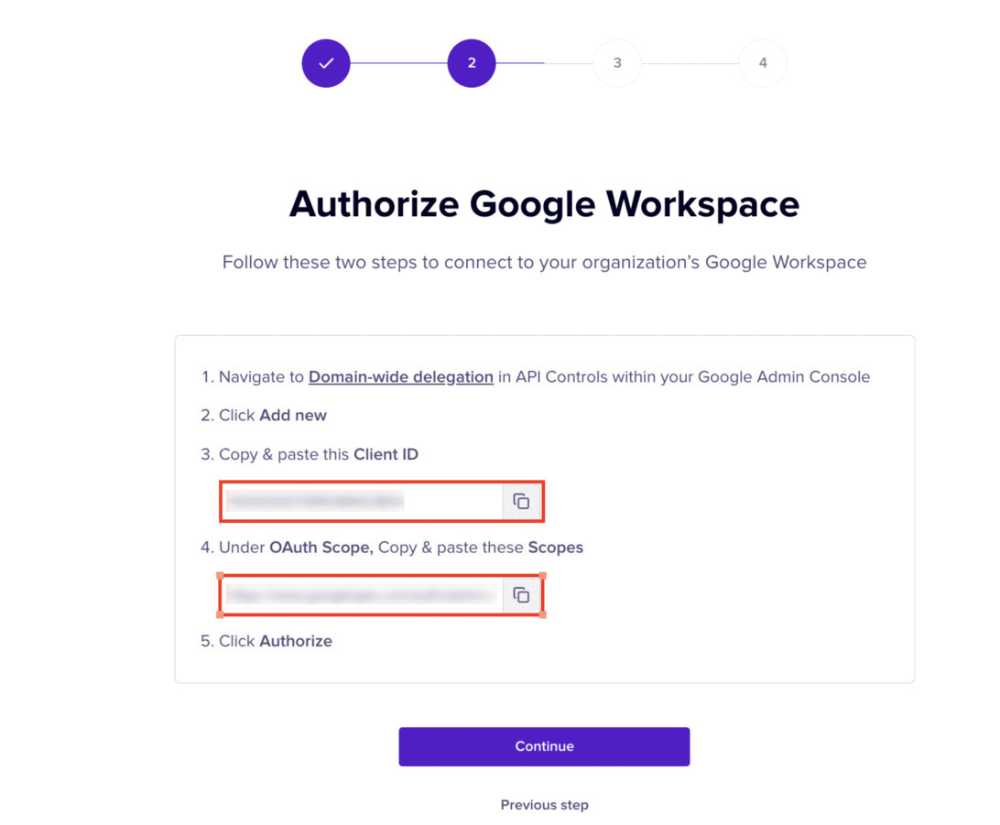

# Google Workspace Directory Service

This document explains the process of adding your Google Workspace tenant to Nightfall to enable Directory Sync. Once you add Google Workspace to Nightfall, you can sync users and user groups data from Google Workspace to Nightfall. To get an overview of the Directory Sync feature in Nightfall, you can read [this article](./) and then proceed with this document.&#x20;

To install Google Directory:

1. Click the **Settings** button in Nightfall.&#x20;

<figure><figcaption></figcaption></figure>

2. Click the **Directory Sync** tab.

<figure><figcaption></figcaption></figure>

3. Click **Add directory**.&#x20;

<figure><figcaption></figcaption></figure>

4. Select **Google Workspace** as the identity provider.&#x20;

<figure><figcaption></figcaption></figure>

5. Copy the **Client ID** and **OAuth Scope ID**. Store these values in a secure place. You require them in the further steps.&#x20;

<figure><figcaption></figcaption></figure>

6. Login to your Google Workspace with an admin account.
7. Click the menu icon.
8. Select **Admin**.

<figure><figcaption></figcaption></figure>

9. In the Admin console left pane, expand **Security** and then expand **Access and data control**.
10. Click **API controls**.

<figure><figcaption></figcaption></figure>

11. Click **MANAGE DOMAIN WIDE DELEGATION** under **Domain wide delegation**.

<figure><figcaption></figcaption></figure>

12. Click **Add New**.

<figure><figcaption></figcaption></figure>

13. Paste the **Client ID** copied from the Nightfall app, in the **Client ID** field.
14. Paste the **Scopes ID** copied from the Nightfall app, under **OAuth Scope** fiel&#x64;**.** Use comma to add multiple scope IDs.&#x20;
15. Click **AUTHORIZE.**&#x20;

<figure><figcaption></figcaption></figure>

16. Return to the Nightfall app and click **Continue**.

<figure><figcaption></figcaption></figure>

17. Click **Connect**.

<figure><figcaption></figcaption></figure>

Once the setup is completed, Nightfall displays the list of active and inactive users in your Google Workspace. Nightfall syncs with your Identity and Access Provider every four hours. Also, you can manually sync once every hour. To sync data manually, click the ellipsis menu and select **Refresh.**

<figure><figcaption></figcaption></figure>

Currently, once registered you cannot unregister an Identity and Access Provider from Nightfall. If you wish to unregister your Identity and Access Provider, please contact Nightfall support.
