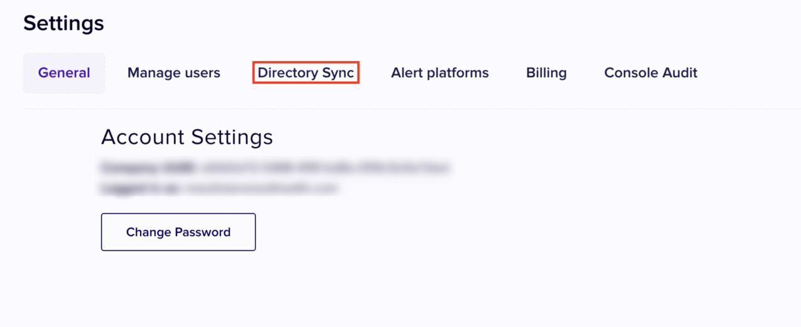

# Add Microsoft Entra ID to Nightfall

This document explains the process of adding your Microsoft Entra ID to Nightfall to enable Directory Sync. Once you add the Microsoft tenant to Nightfall, you can sync users and user groups data from Microsoft to Nightfall. To get an overview of the Directory Sync feature in Nightfall, you can read [this article](./) and then proceed with this document.&#x20;

## Prerequisites

* You must have a Microsoft Entra ID (formerly known as Microsoft Azure Active Directory) account.
* A Microsoft Entra user account for Nightfall with one of the following roles:&#x20;
  * Global Administrator or Privileged Role Administrator, for granting consent for apps requesting any permission, for any API.
  * Cloud Application Administrator or Application Administrator, for granting consent for apps requesting any permission for any API, except Microsoft Graph app roles (application permissions).
  * A custom directory role that includes the permission to grant permissions to applications, for the permissions required by the application.
  * For more information, refer to the Microsoft documentation [here](https://learn.microsoft.com/en-us/entra/identity/enterprise-apps/grant-admin-consent?pivots=ms-graph#prerequisites).

## Configure Microsoft Entra ID

1. Click the **Settings** button on the Nightfall console (bottom-left).&#x20;
2. Click the **Directory Sync** tab.

<figure><figcaption></figcaption></figure>

3. Click **Add Directory**.&#x20;

<figure><figcaption></figcaption></figure>

4. Select **Azure Entra** as the identity provider.&#x20;

<figure><figcaption></figcaption></figure>

5. Click **Connect**.&#x20;

<figure><figcaption></figcaption></figure>

6. Enter Email or phone number associated with your Microsoft Azure account.&#x20;
7. Click **Next**.

<figure><figcaption></figcaption></figure>

8. Enter your password and click **Sign In.**

When you sign in as an Azure admin, you can consent the installation of Nightfall IDP yourself. You can view the following screen. You must click **Accept**.&#x20;

<figure><figcaption></figcaption></figure>

Once you approve the request, the installation proceeds. Once the installation is completed, you can see the following screen. You must click **Setup Complete**.

<figure><figcaption></figcaption></figure>

After the setup is complete, the first sync may take 15 to 30 min to complete. While the first sync is in progress you would see  "pending" under status. Once the sync is complete, the status would transition from "pending" to "synced" and you can view the number of active users, inactive users and groups discovered.&#x20;

<figure><figcaption></figcaption></figure>


Active users in Azure are the users who actively log in to Azure and perform various tasks.&#x20;

Inactive users are dormant users who have not logged in to their Azure account for a while. You can refer to this [Microsoft document](https://learn.microsoft.com/en-us/entra/identity/monitoring-health/howto-manage-inactive-user-accounts) to learn more about managing inactive users.


Nightfall syncs with your Identity and Access Provider every four hours. Also, you can manually sync once every hour. To sync data manually, click the ellipsis menu and select **Refresh.**

<figure><figcaption></figcaption></figure>

Currently, once registered you cannot unregister an Identity and Access Provider from Nightfall. If you do wish to unregister your Identity and Access Provider, please contact Nightfall support.

