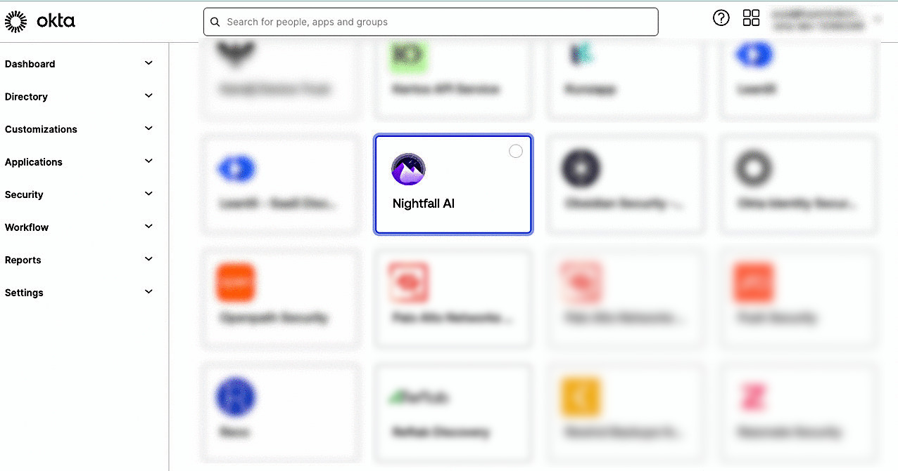
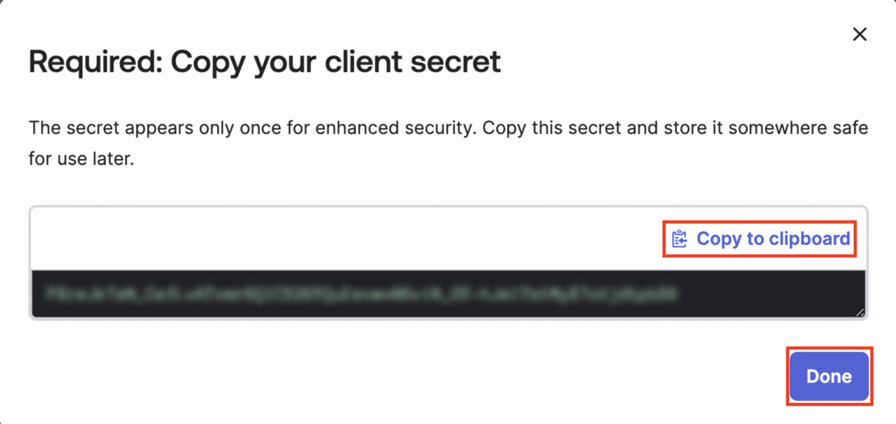
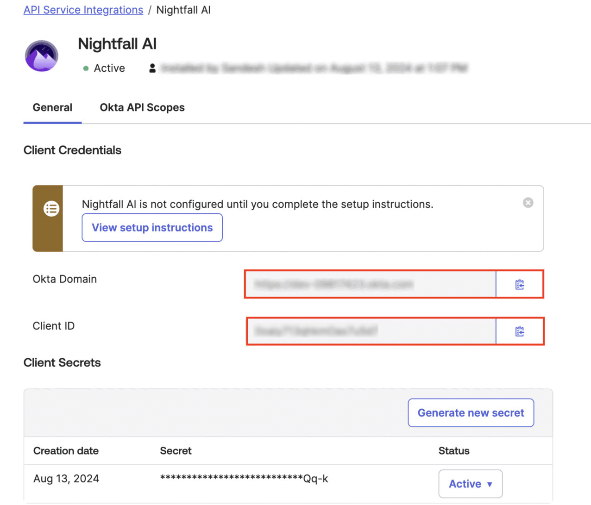
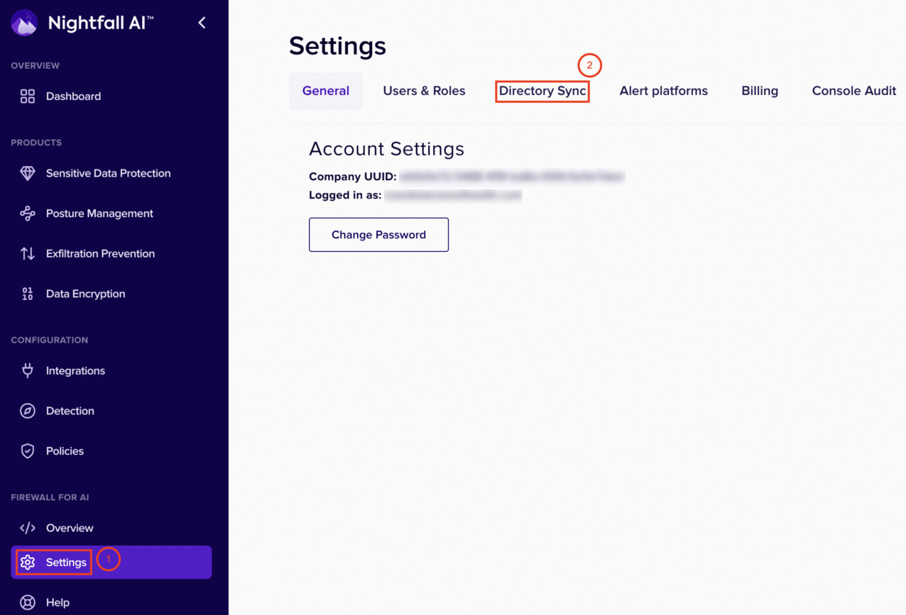
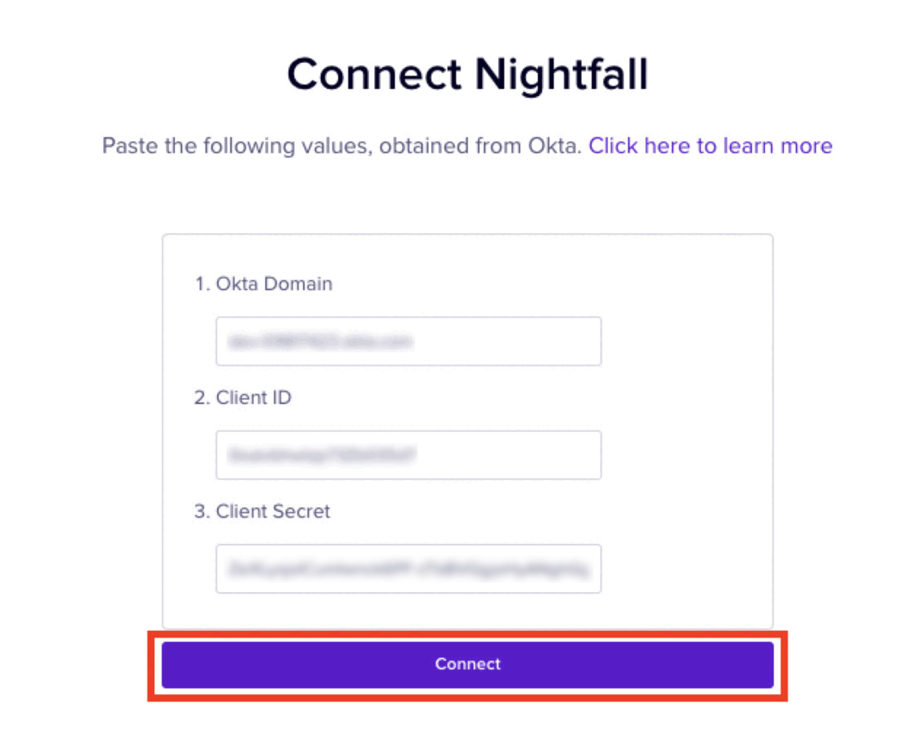
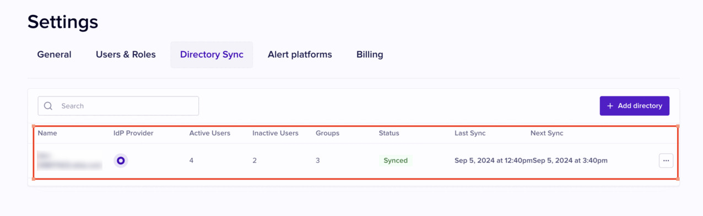

# Add Okta to Nightfall

This document explains the process of adding your Okta tenant to Nightfall to enable Directory Sync. Once you add Okta to Nightfall, you can sync users and user groups data from your Okta account to Nightfall. To get an overview of the Directory Sync feature in Nightfall, you can read [this article](./) and then proceed with this document.&#x20;

In this document you are basically authorizing the Nightfall application in Okta. The authorization process involves two steps. In the first step, you authorize the Nightfall app in the Okta console. This process generates an Okta domain, client ID and client secret. You must copy these values. In the second step, you must paste these values in the Nightfall console to complete the process.&#x20;

## Prerequisites

* You must have admin access to your Okta account.&#x20;

## Integrating Nightfall in Okta

1. Log in to your Okta account with admin credentials and navigate to the admin console.&#x20;
2. In the left pane, expand **Applications** and select **API Service Integrations**.

<figure><figcaption></figcaption></figure>

3. Click **Add Integration**.
4. Select the **Nightfall AI** integration.&#x20;

<figure><figcaption></figcaption></figure>

5. Click **Install & Authorize**.

<figure><figcaption></figcaption></figure>

6. The client secret is generated. Click **Copy to clipboard** and store this secret securely. You cannot view this secret again.&#x20;
7. Click **Done**.&#x20;

<figure><figcaption></figcaption></figure>

7. Copy the values in the **Okta Domain** and **Client ID** fields.&#x20;

<figure><figcaption></figcaption></figure>

## Configuring Okta in Nightfall

1. Log in to your Nightfall console.
2. In the left pane, click the **Settings** menu.
3. Click the **Directory Sync** tab.

<figure><figcaption></figcaption></figure>

4. Click **Add directory**.&#x20;

<figure><figcaption></figcaption></figure>


If you have already created IdP with Google Workspace or Microsoft Entra, you can view the list of IdP(s). In this case, you must click the **+ Add Directory** button.&#x20;


5. Click **Set up** on the Okta widget.&#x20;

<figure><figcaption></figcaption></figure>

6. Paste the **Okta Domain**, **Client ID,** and **Client Secret** values, obtained in the previous section.&#x20;
7. Click **Connect** (This button is activated only after you enter the values as mentioned in the previous step).

<figure><figcaption></figcaption></figure>

6. A dialogue box with successful connection message is displayed. Click **Finish** to complete the process.&#x20;

<figure><figcaption></figcaption></figure>

You can view the connection details as shown in the following image. Click **+ Add directory** to authorize the Nightfall app on additional Okta domains.&#x20;

&#x20;

<figure><figcaption></figcaption></figure>
