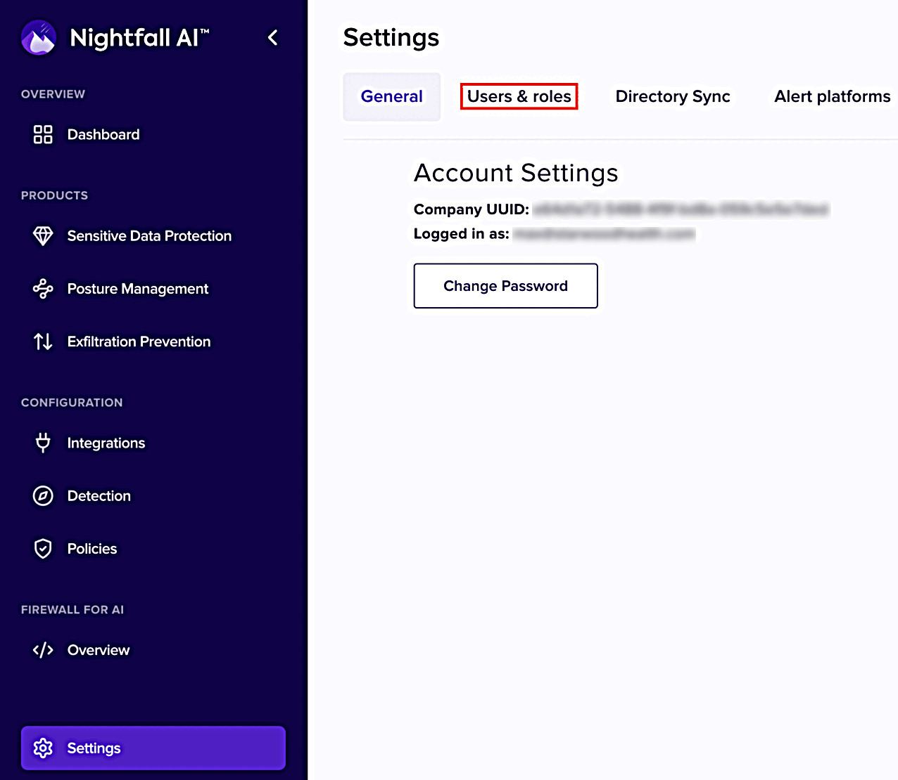
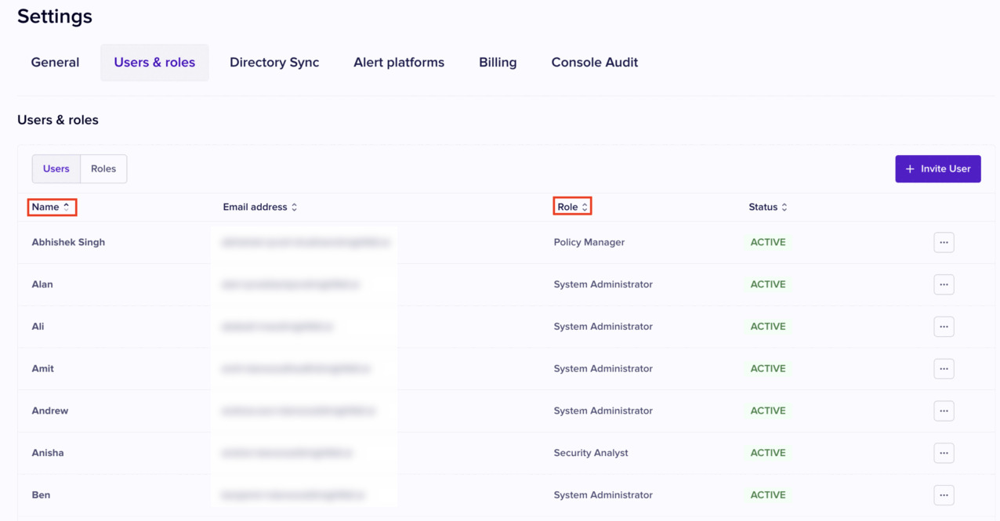
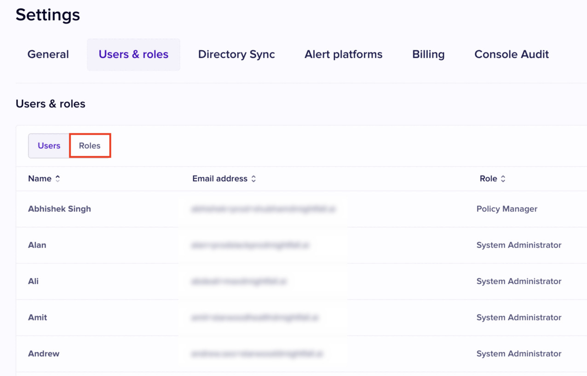

# Role Based Access Control (RBAC)

Role Based access control (RBAC) streamlines permissions to various resources within the Nightfall console. There are two key components of RBAC within Nightfall - roles and permissions.&#x20;

A role is a collection of pre-defined permissions that can be assigned to user accounts within Nightfall. Default roles cannot be edited. A role can be assigned to more than one user account whereas an user account can only have one role. Permissions refer to the specific create, read, update, and delete actions you can take on resources such as policies, events, apps, etc within Nightfall.&#x20;

## Accessing the Users and Roles Page

To access the Users and Roles page:

1. Click **Settings** from the left menu.

<figure><figcaption></figcaption></figure>

2. Click the **Users & roles** tab.

<figure><figcaption></figcaption></figure>

You can view the list of Users and the roles assigned to each user.&#x20;

<figure><figcaption></figcaption></figure>

Click the **Roles** tab to access the Roles page.

<figure><figcaption></figcaption></figure>

The Roles page displays the Role name, Permissions assigned to a role and the number of users to whom the role is assigned, as shown in the following image.

<figure><figcaption></figcaption></figure>

You can click the **View permission details** button to expand the complete list of permissions associated with a Role.

<figure><figcaption></figcaption></figure>


Currently, you can assign only a maximum of one role to a user. Also, you cannot create custom Roles and must use the out of the box Roles provided by Nightfall.


## Roles and Permissions

Nightfall provides you with five Roles. Each of the five Roles is associated with multiple permissions. The following table lists each role and the permissions associated with the Role.&#x20;

| Role                        | Permissions                                                                                                                                                                                                                                                                                                                                                                                                                                                                                                                                                                                                                                                                                                                                                                                                                                                                                                                                                                                                                                                                                                                                                                                                                                                                                                                                                                                                                                                                                                                                                                                                                                                   |
| --------------------------- | ------------------------------------------------------------------------------------------------------------------------------------------------------------------------------------------------------------------------------------------------------------------------------------------------------------------------------------------------------------------------------------------------------------------------------------------------------------------------------------------------------------------------------------------------------------------------------------------------------------------------------------------------------------------------------------------------------------------------------------------------------------------------------------------------------------------------------------------------------------------------------------------------------------------------------------------------------------------------------------------------------------------------------------------------------------------------------------------------------------------------------------------------------------------------------------------------------------------------------------------------------------------------------------------------------------------------------------------------------------------------------------------------------------------------------------------------------------------------------------------------------------------------------------------------------------------------------------------------------------------------------------------------------------- |
| Security Analyst            | <ol><li><a href="security_analyst.md#exfiltration-posture-management-events">Exfiltration Events</a> </li><li><a href="security_analyst.md#preview-the-dlp-violations-content">Content Preview</a></li><li><a href="security_analyst.md#view-dashboard-and-create-reports">Dashboard</a></li><li><a href="security_analyst.md#view-detectors">Detectors</a></li><li><a href="security_analyst.md#take-actions-on-dlp-violations">DLP Violations</a></li><li><a href="security_analyst.md#view-dashboard-and-create-reports">Reporting</a></li><li>Encryption Events</li></ol>                                                                                                                                                                                                                                                                                                                                                                                                                                                                                                                                                                                                                                                                                                                                                                                                                                                                                                                                                                                                                                                                                 |
| Policy Manager              | <ol><li><a href="policy_manager.md#integrations">App Alert Management</a></li><li><a href="policy_manager.md#detectors">Detectors</a></li><li><a href="policy_manager.md#policies">DLP Policies</a></li><li><a href="policy_manager.md#detection-rules">Detection Rules</a></li><li><a href="policy_manager.md#integrations">App Management</a></li><li><a href="policy_manager.md#policies">Exfiltration/Posture Policies</a></li><li>Encryption Polices</li></ol>                                                                                                                                                                                                                                                                                                                                                                                                                                                                                                                                                                                                                                                                                                                                                                                                                                                                                                                                                                                                                                                                                                                                                                                           |
| Security Events Manager     | <ol><li><a href="security_events_manager.md#exfiltration-posture-management-and-encryption-events">Exfiltration Events</a></li><li><a href="security_events_manager.md#preview-the-dlp-violations-content">Content Preview</a></li><li><a href="security_events_manager.md#view-dashboard-and-create-reports">Dashboard</a></li><li><a href="security_events_manager.md#view-detectors">Detectors</a></li><li><a href="security_events_manager.md#take-actions-on-dlp-violations">DLP Violations</a></li><li><a href="security_events_manager.md#view-dashboard-and-create-reports">Reporting</a></li><li>Encryption Events</li></ol>                                                                                                                                                                                                                                                                                                                                                                                                                                                                                                                                                                                                                                                                                                                                                                                                                                                                                                                                                                                                                         |
| Security Operations Manager | <ol><li><a href="security_operations_manager.md#exfiltration-posture-management-and-encryption-events">Exfiltration Events</a></li><li><a href="security_operations_manager.md#preview-the-dlp-violations-content">Content Preview</a></li><li><a href="security_operations_manager.md#detection-rules">Detection Rules</a></li><li><a href="security_operations_manager.md#view-dashboard-and-create-reports">Dashboard</a></li><li><a href="security_operations_manager.md#exfiltration-posture-management-and-encryption-events">Encryption events</a></li><li><a href="security_operations_manager.md#detectors">Detectors</a></li><li><a href="security_operations_manager.md#policies">DLP Policies</a></li><li><a href="security_operations_manager.md#take-actions-on-dlp-violations">DLP Violations</a></li><li><a href="security_operations_manager.md#app-management-and-app-alert-management">App Alert Management</a></li><li><a href="security_operations_manager.md#view-dashboard-and-create-reports">Reporting</a></li><li>Encryption policies</li><li><a href="security_operations_manager.md#app-management-and-app-alert-management">App Management</a></li><li><a href="security_operations_manager.md#policies">Exfiltration/Posture Policies</a></li></ol>                                                                                                                                                                                                                                                                                                                                                                             |
| System Administrator        | <ol><li><a href="system_administrator.md#billing">Billing</a></li><li><a href="security_operations_manager.md#exfiltration-posture-management-and-encryption-events">Exfiltration Events</a></li><li><a href="security_operations_manager.md#preview-the-dlp-violations-content">Content Preview</a></li><li><a href="security_operations_manager.md#detection-rules">Detection Rules</a></li><li><a href="system_administrator.md#user-management">User Management</a></li><li><a href="security_operations_manager.md#view-dashboard-and-create-reports">Dashboard</a></li><li><a href="security_operations_manager.md#exfiltration-posture-management-and-encryption-events">Encryption events</a></li><li><a href="security_operations_manager.md#detectors">Detectors</a></li><li><a href="security_operations_manager.md#policies">DLP Policies</a></li><li><a href="system_administrator.md#alert-management">Alert Service</a></li><li><a href="security_operations_manager.md#take-actions-on-dlp-violations">DLP Violations</a></li><li><a href="security_operations_manager.md#app-management-and-app-alert-management">App Alert Management</a></li><li><a href="system_administrator.md#directory-sync">Directory Sync</a></li><li><a href="security_operations_manager.md#view-dashboard-and-create-reports">Reporting</a></li><li>Encryption Policies</li><li><a href="security_operations_manager.md#app-management-and-app-alert-management">App Management</a></li><li><a href="security_operations_manager.md#policies">Exfiltration/Posture Policies</a></li><li><a href="system_administrator.md#firewall-for-ai">API Keys</a></li></ol> |

You can learn more about each of the role from the following links.

[security\_analyst.md](security_analyst.md "mention")

[policy\_manager.md](policy_manager.md "mention")

[security\_events\_manager.md](security_events_manager.md "mention")

[security\_operations\_manager.md](security_operations_manager.md "mention")

[system\_administrator.md](system_administrator.md "mention")
