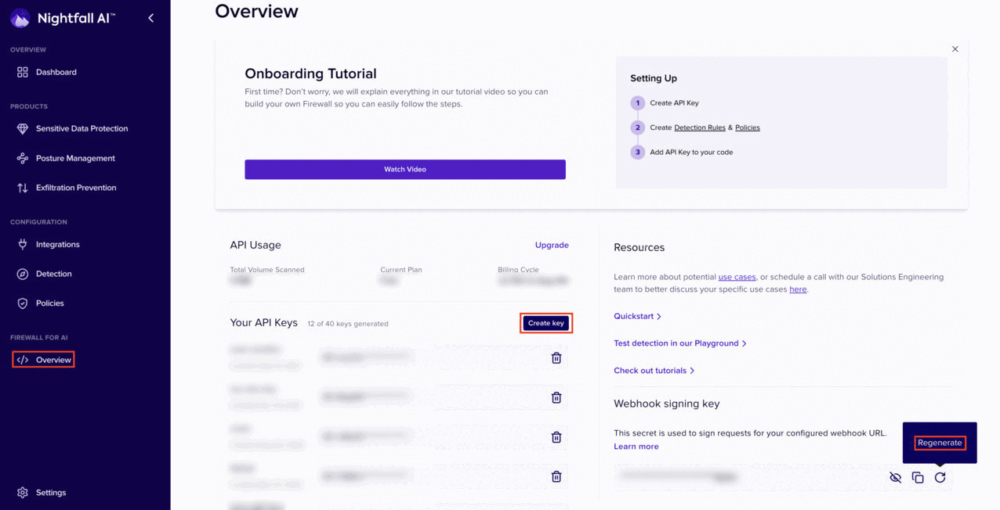

# System Administrator Role

Users with the System administrator role have access to the whole Nightfall application. There is no restricted resource from the system administrator user. Users with System adminstrator roles can create API keys for Firewall for AI. They can also add or remove users from the Nightfall app and edit a user's current role. System administrators also have full access to the Nightfall settings configurations.&#x20;

The Nightfall app view for a user with this role is as shown in the following image.&#x20;

<figure><figcaption></figcaption></figure>

## Permissions Associated with System Administrator Role

A user with the System Administrator role can perform all the tasks as in case of a [security\_operations\_manager.md](security_operations_manager.md "mention"). Additionally, the following tasks can also be performed.&#x20;

### Firewall for AI Keys

With the **API Keys** permission, users can create new API keys and delete existing API keys. Users can also view or regenerate the webhook signing key.&#x20;

<figure><figcaption></figcaption></figure>

### User Management

With the User Management permission, users can add, edit or delete users from the Nightfall app. Admin users can also modify the roles of existing users.&#x20;

<figure><figcaption></figcaption></figure>

### Alert Management

The **alert management** permission allows users to configure alert platforms. These alert platforms can be used as notification channels while configuring integrations or  creating policies for an integration.

<figure><figcaption></figcaption></figure>

### Directory Sync

The Directory Sync permission allows users to configure directory sync services to configure policies related to Google Drive and Microsoft.&#x20;

<figure><figcaption></figcaption></figure>

### Billing

The Billing page allows users to view their current plan and other details related to the current plan. Users can also view the integrations also view the Nightgall products being used by the organization.&#x20;

<figure><figcaption></figcaption></figure>

As mentioned above, apart from the above permissions, administrator user has access to all the other sections of Nightfall app which are accessible to a user with the [security\_operations\_manager.md](security_operations_manager.md "mention").&#x20;
