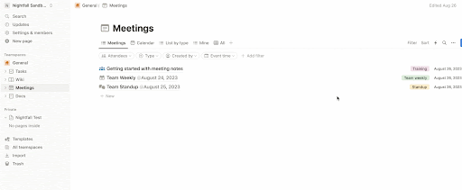
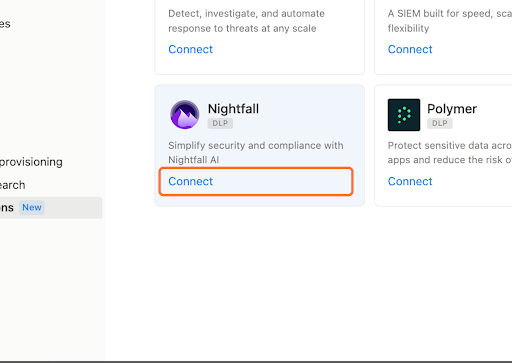
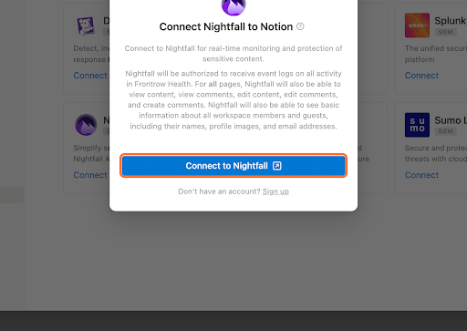
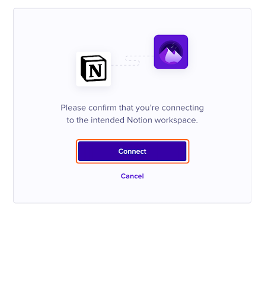

# Install Nightfall for Notion

This section describes how to install the Nightfall DLP for Notion. You can implement data leak prevention in your Notion environment only after installing this integration.

To install Nightfall for Notion:

1. Log in to your Notion account.&#x20;
2. Switch to the Workspace that you wish to add to Nightfall.&#x20;
3. Click **Settings** and members in the left pane.&#x20;
4. Click **Connections** under the Workspace menu.&#x20;
5. Click the **Workspace** tab.

<figure><figcaption></figcaption></figure>

6. Click **See All** to view all the Connections available in Notion (This option ensures that the Nightfall connection is displayed).

<figure><figcaption></figcaption></figure>

7. Click **Connect** on the Nightfall widget.

<figure><figcaption></figcaption></figure>

8. Click **Connect to Nightfall**.

<figure><figcaption></figcaption></figure>

9. A pop-up will appear that will be logged into your Nightfall instance. Click **Connect**.

<figure><figcaption></figcaption></figure>

A pop-up will appear that will be logged into your Nightfall instance. Click **Connect**.
