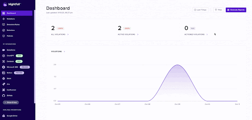

# Verification of Notion Installation

Once you install the Nightfall DLP for Notion, you must ensure that the installation is successful and also the selected Notion Workspace is added to Nightfall. This section describes how to accomplish these tasks.

To verify Notion installation:

1. Log in to the Nightfall application
2. Click Notion under the Integrations section.

If the integration was installed successfully on the Notion UI, the Notion integration in Nightfall displays the name of the Notion workspace.

3. Verify the name of the Notion workspace that you added to Nightfall.

<figure><figcaption></figcaption></figure>
