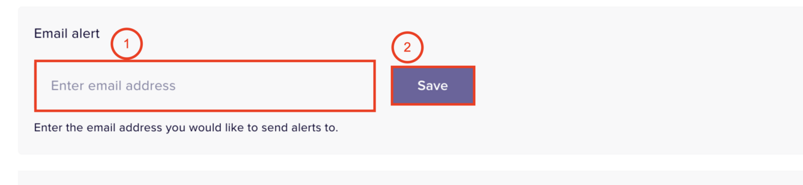

# Configure Alerts for Notion

The Nightfall DLP for Notion supports the configuration of alerts at the policy level and the integration level. Alerts for Notion can be sent to the following alert destinations.

* [Slack](https://help.nightfall.ai/sensitive-data-protection/notion/configuring-integration-alerts#configuring-slack-as-an-alert-channel)&#x20;
* [Email](https://help.nightfall.ai/sensitive-data-protection/notion/configuring-integration-alerts#configuring-email-as-an-alert-channel)
* [Webhook](https://help.nightfall.ai/sensitive-data-protection/notion/configuring-integration-alerts#configuring-webhook-as-an-alert-channel)
* [Jira Tickets](https://help.nightfall.ai/sensitive-data-protection/notion/configuring-integration-alerts#configuring-jira-as-an-alert-channel)

<figure><figcaption></figcaption></figure>

When you configure alert settings at the integration level, the alert settings apply to all the policies, created for the Notion DLP integration. However, when you configure alert settings specifically for a policy, which is created in the Notion DLP integration, the alert settings are applicable only for that specific policy.&#x20;

This document explains how to configure alerts at the integration level. To learn about how to configure alerts at the policy level, read [this document](../gmail/policies/advanced_settings.md#admin-alerting).

## Prerequisites

* To use Slack as an alert platform, you must first perform the required Slack configurations. You can refer to [this document](https://help.nightfall.ai/nightfall-ai/detection/setting-up-slack-as-an-alert-channel-in-nightfall) to learn more about how to configure Slack as an Alert platform.&#x20;
* To use Webhook as an alert platform, you must first perform the required Webhook configurations. You can refer to [this document](https://help.nightfall.ai/nightfall-ai/operationalizing-dlp/integrating-with-security-tools/integrating-with-siem#configuring-outgoing-webhooks)to learn more about how to configure Webhook as an Alert platform. &#x20;
* To use JIRA as an alert platform, you must have the DLP for the JIRA app installed from the [Atlassian Marketplace](https://marketplace.atlassian.com/apps/1226823/dlp-for-jira-nightfall-ai?tab=overview\&hosting=cloud). You can read more about the DLP for JIRA integration [here](https://help.nightfall.ai/nightfall-ai/nightfall-for-jira/getting-started/installing-nightfall-for-jira).&#x20;

## Configure Alerts at the Integration Level&#x20;

You can configure alerts at the integration level once you have installed the Nightfall for Notion DLP  integration.&#x20;

To configure alerts at the integration level:

1. Navigate to the Notion DLP integration
2. Scroll down to the **Alerting** section.
3. You can configure one or multiple alert channels.&#x20;

### Configuring Slack as an Alert Channel

1. To configure Slack as an alert channel, click **+ Slack channel**.

<figure><figcaption></figcaption></figure>

2. In the **Slack alert channel** field, enter the name of the Slack channel in which you wish to receive the alerts.&#x20;
3. Click **Save**.&#x20;

<figure><figcaption></figcaption></figure>

A confirmation pop-up box is displayed to confirm if the Slack channel (entered in the second step) must be used only for Notion DLP integration or all the Nightfall integrations.&#x20;

4. Select **No, only integration level** to use the Slack channel only for Notion DLP, or select **Yes, please** to use the selected Slack channel for all the Nightfall integrations.&#x20;

<figure><figcaption></figcaption></figure>

### Configuring Email as an Alert Channel

1. Click **+ Email**.

<figure><figcaption></figcaption></figure>

2. Enter the Email ID of the recipient who should receive the notification&#x73;**.**&#x20;
3. Click **Save.**&#x20;

<figure><figcaption></figcaption></figure>

A confirmation pop-up box is displayed to confirm if the Email ID (entered in the second step) must be used only for Notion DLP integration or all the Nightfall integrations.&#x20;

4. Select **No, only integration level** to use the Slack channel only for Notion DLP, or select **Yes, please** to use the selected Slack channel for all the Nightfall integrations.&#x20;

<figure><figcaption></figcaption></figure>

### Configuring Webhook as an Alert Channel

1. Click **+ Webhook**.
2. Enter the Webhook URL.
3. Click **Test**. If the test result is not successful, check the Webhook URL.
4. (Optional) Click **Add Header** to add headers.&#x20;
5. Click **Save**.

<figure><figcaption></figcaption></figure>


When you configure alerts to a Webhook, Nightfall AI sends occasional posts to:

* To validate that the Webhook is properly configured before the policy is saved.
* Periodically thereafter to ensure that the Webhook is still valid.

The response to the test Webhooks is `200` status code if successful.

An example of Webhook request is as follows.

<pre class="language-json"><code class="lang-json"><strong>{
</strong>  "service": "nightfall",
  "test": true,
  "timestamp": "2024-03-07T23:18:39Z"
}
</code></pre>

This is part of alert event consumption and can be ignored.&#x20;


### **Configuring JIRA as an Alert Channel**

1. Click **+ Jira Ticket.**
2. Select a JIRA project from the **Jira Project** drop-down menu.
3. Select an issue type from the **Issue Type** drop-down menu.&#x20;
4. (Optional) Add comments to be added in the JIRA ticket.&#x20;
5. Click **Save changes**.

<figure><figcaption></figcaption></figure>

A confirmation pop-up box is displayed to confirm if the JIRA settings configured for the Notion DLP integration must be applied to all the other Nightfall integrations too.&#x20;

6. Select **No, only integration level** to use the configurations only for Notion DLP, or select **Yes, please** to use the selected JIRA configurations for all the Nightfall integrations.&#x20;

<figure><figcaption></figcaption></figure>

## Configure End-User Notification

When an Event is triggered, Nightfall sends a notification to the end-user whose actions triggered the Event. While notifying the end-user, Nightfall also sends a text message. You can draft the text message to be sent to the end-user. This message applies to all the policies. Click **Save changes** once done.

<figure><figcaption></figcaption></figure>
