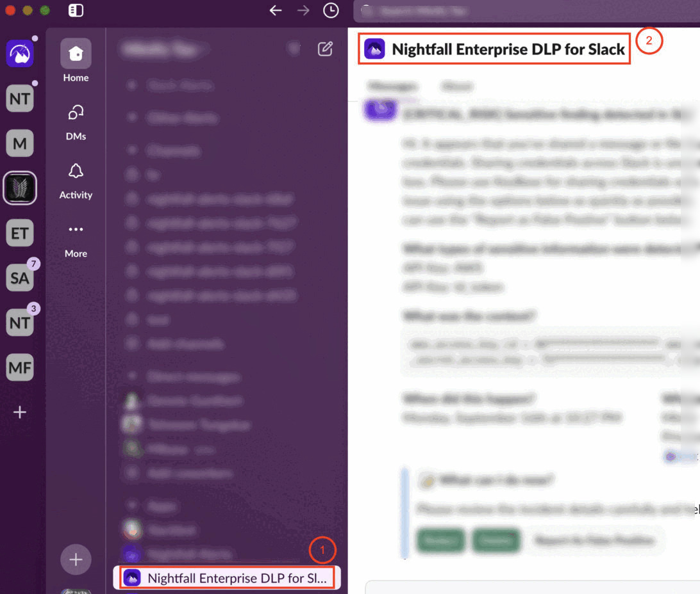

# How do I re-install Nightfall DLP for Slack Enterprise Edition?

You must reinstall Slack to get the latest Slack integration features released by Nightfall. This document explains the process to reinstall the Slack app.&#x20;

1. In the Slack application, click **Nightfall Enterprise DLP for Slack** under the **Apps** section.
2. Click **Nightfall Enterprise DLP for Slack** on the to&#x70;_._

<figure><figcaption></figcaption></figure>

3. Click **Configuration**.

<figure><figcaption></figcaption></figure>

4. Ensure that a new browser window opened up and the **Configuration** tab is selected.&#x20;
5. Scroll down and click **Remove app**.

<figure><figcaption></figcaption></figure>

6. A confirmation pop-up window is displayed. Click **Remove app** again to confirm the uninstallation of the Slack app.
7. Login to the Nightfall application.&#x20;
8. Click **Integrations**.
9. Click **Manage** for the Slack integration.

<figure><figcaption></figcaption></figure>

6. Click **Begin Setup**.
7. A confirmation window opens. Scroll down and click **Allow**.

Follow the on screen instruction and complete the setup.&#x20;
