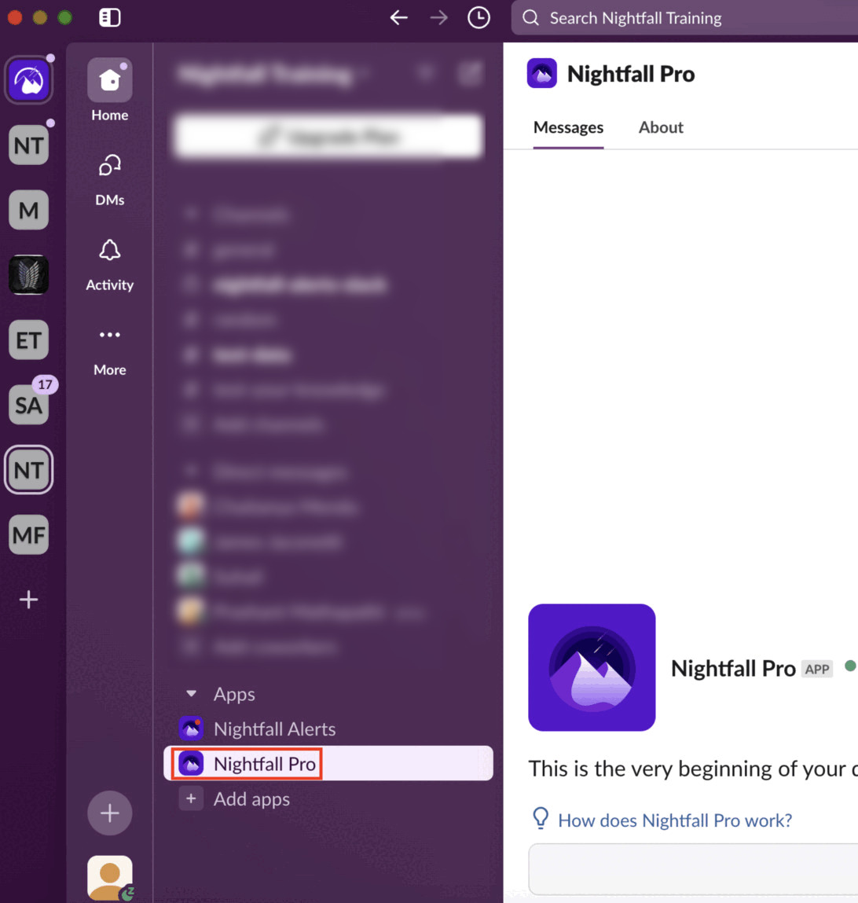

# How do I re-install Nightfall DLP for Slack Pro Edition?

You must reinstall Slack to get the latest Slack integration features released by Nightfall. This document explains the process to reinstall the Slack app.&#x20;

1. In the Slack application, click **Nightfall Pro** under the Apps section.

<figure><figcaption></figcaption></figure>

2. Click on **Nightfall Pro** on the to&#x70;_._

<figure><figcaption></figcaption></figure>

3. Click **Configuration**.

<figure><figcaption></figcaption></figure>

4. Ensure that a new browser window opened up and the **Configuration** tab is selected.&#x20;
5. Scroll down and click **Remove app**.

<figure><figcaption></figcaption></figure>

6. A confirmation pop-up window is displayed. Click **Remove app** again to confirm the uninstallation of the Slack app.
7. Login to the Nightfall application.&#x20;
8. Click **Integrations**.
9. Click **Manage** for the Slack integration.

<figure><figcaption></figcaption></figure>

10. Click **Begin Setup**.

<figure><figcaption></figcaption></figure>

11. Click **Allow**.

<figure><figcaption></figcaption></figure>

Follow the on screen instruction and complete the setup.&#x20;
