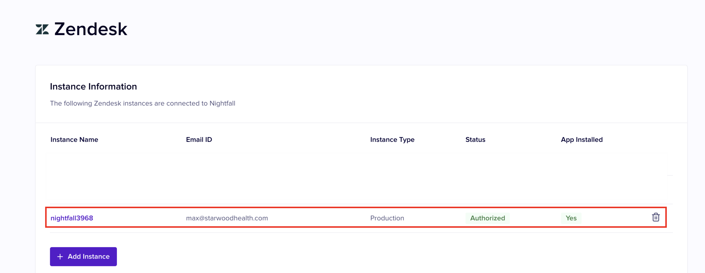

# Install Nightfall DLP for Zendesk

### First-time setup: Adding your first Zendesk instance

1\. Click **Begin Setup** to start the simple installation flow via Nightfall&#x20;

<figure><figcaption></figcaption></figure>

2. Nightfall for Zendesk supports both sandbox and production instances. Please select the one applicable to your setup. In this example, we will be onboarding a production instance.&#x20;
3. Click **Continue** once you select your instance type.&#x20;
4. Type in your Zendesk subdomain or Instance name in the text field. In this example, we added _nightfall3968._ Select **Connect to Zendesk** when completed. This will navigate to the Zendesk sign-in page where we recommend the service account with full admin privileges is used.&#x20;
5. Select  **Switch to agent sign-in** (if applicable), then proceed to add the email and password associated with either a service account (_Recommended)_ or a user account that has full Zendesk admin privileges.&#x20;
6. You will be navigated to an authentication page with more information on how Nightfall and Zendesk will establish a secure connection. Please click **Allow** to continue
7. Once you select **Allow,** you will be navigated back to Nightfall and be prompted to install the Nightfall DLP Zendesk Marketplace app.&#x20;
   * _**Note**: Authentication and App installation for Zendesk are two independent steps. Both need to be completed for the setup to be complete._&#x20;
8. If you have already installed the app via the Zendesk Marketplace, you can go directly to Step 9. Click **Install**. In a new tab, you will be prompted to install the Nightfall DLP Zendesk marketplace app via the Zendesk Admin console.
   * Optional: Add Role or Group restrictions which will limit who can remove or add the applications from Zendesk.&#x20;
9. Congratulations :tada: You now have a fully set up instance of Zendesk connected with Nightfall!

<figure><figcaption></figcaption></figure>

11. In Settings, ensure the **Status** and **App Installed** are '**Authorized**' and **'Yes'** with a green highlight. If a Zendesk instance becomes disconnected, you can use this settings page to monitor and reconfigure any connections as needed. &#x20;

<figure><figcaption></figcaption></figure>

### &#x20;Adding additional Zendesk instances

12. If you would like to add another instance of Zendesk, Click **+ Add Instance** and repeat steps 1-10 above.&#x20;

If you have any questions about the installation process, please email us at support@nightfall.ai
